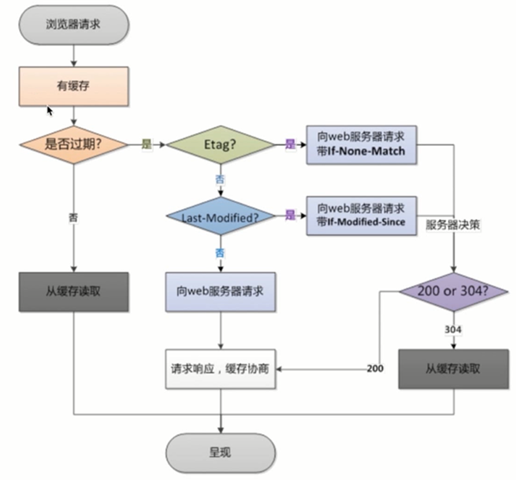

[回到首页](../README.md)

# 1. 缓存

缓存机制的一些概念和问题

[TOC]

## 1.1. 缓存分类

### 1.1.1. PHP缓存

1、opcache，将编译后的字节码缓存下来，下次就不需要编译

2、yac内存缓存

3、file文件缓存，框架中一般自己会封装

> 参考：
>
> 1、[PHP Opcache 注意事项以及调优 | PHP 技术论坛 (learnku.com)](https://learnku.com/php/t/34638)

### 1.1.2. Nginx缓存

#### 1.1.2.1. 浏览器缓存配置

```http
// 返回头部
cache-control: maxage=2592000
content-encoding: gzip
content-security-policy: script-src https: 'unsafe-inline' 'unsafe-eval' *.baidu.com
content-type: application/x-javascript;charset=utf-8
date: Thu, 19 Aug 2021 11:32:53 GMT
etag: W/1e46de85b877e9fc4f812d5096de8a20
expires: Wed, 08 Sep 2021 03:12:41 GMT
```

```http
// 请求头部
cache-control: max-age=0
if-modified-since: Wed, 08 Sep 2021 03:12:41 GMT
if-none-match: W/1e46de85b877e9fc4f812d5096de8a20
```

nginx通过返回的`Expires`，`Cache-control`等头部字段告诉浏览器是否要缓存及过期的时间；并通过浏览器请求时的`Etag`头部字段判断是返回304，还是重新请求字段

 

配置语法：

1、expires：添加Cache-Control、Expires头

```nginx
Syntax:	expires [modified] time;
		expires epoch | max | off;
Default:	expires off;
Context:	http, server, location, if in location
```

> 参考：
>
> 1、[nginx 缓存设置 - walkfade - 博客园 (cnblogs.com)](https://www.cnblogs.com/sreops/p/11073277.html)
>
> 2、[深入理解浏览器的缓存机制 - SegmentFault 思否](https://segmentfault.com/a/1190000017004307)
>
> 3、[图解Http缓存控制之max-age=0、no-cache、no-store区别 - 知乎 (zhihu.com)](https://zhuanlan.zhihu.com/p/55623075)

#### 1.1.2.2. proxy_cache缓存：缓存后端的内容，可以是静态或动态资源

配置语法：

1、proxy_cache_path：缓存的路径，空间，占用大小等

```nginx
Syntax:	proxy_cache_path path [levels=levels] [use_temp_path=on|off] keys_zone=name:size [inactive=time] [max_size=size] [min_free=size] [manager_files=number] [manager_sleep=time] [manager_threshold=time] [loader_files=number] [loader_sleep=time] [loader_threshold=time] [purger=on|off] [purger_files=number] [purger_sleep=time] [purger_threshold=time];
Default:	—
Context:	http
```

2、proxy_cache：缓存的开关，使用的空间

```nginx
Syntax:	proxy_cache zone | off;
Default:	proxy_cache off;
Context:	http, server, location
```

3、proxy_cache_methods：哪些HTTP动作才缓存

```nginx
Syntax:	proxy_cache_methods GET | HEAD | POST ...;
Default:	proxy_cache_methods GET HEAD;
Context:	http, server, location
```

4、proxy_cache_valid：缓存有效期

```nginx
Syntax:	proxy_cache_valid [code ...] time;
Default:	—
Context:	http, server, location
```

5、proxy_cache_key：缓存使用的key，用于索引

```nginx
Syntax:	proxy_cache_key string;
Default:	proxy_cache_key $scheme$proxy_host$request_uri;
Context:	http, server, location
```

实例：

```nginx
http {
    # 省略一些配置
    
    upstream imooc {
        server 116.62.103.228:8001;
        server 116.62.103.228:8002;
        server 116.62.103.228:8003;
    }

    proxy_cache_path /opt/app/cache levels=1:2 keys_zone=imooc_cache:10m max_size=10g inactive=60m use_temp_path=off;

	server {
        listen       80;
        server_name  web01.fadewalk.com;

        access_log  /var/log/nginx/test_proxy.access.log  main;

        location / {
            proxy_cache off;
            proxy_pass http://imooc;

            proxy_cache_valid 200 304 12h;
            proxy_cache_valid any 10m;
            proxy_cache_key $host$uri$is_args$args;
            add_header  Nginx-Cache "$upstream_cache_status";

            proxy_next_upstream error timeout invalid_header http_500 http_502 http_503 http_504;
            include proxy_params;
	   }
    }
}
```

#### 1.1.2.3. fastcgi_cache缓存：缓存php返回的内容，减少对php的请求

用的少，不详细写了

### 1.1.3. 浏览器缓存

见1.2.1

## 1.2. 缓存常见问题

### 1.2.1. 缓存穿透

概念：数据库不存在的数据不会被缓存，访问这个数据则每次都会查数据库，给数据库带来压力

解决方案：

1、提高缓存命中率

2、校验前置，过滤非法请求（比如id<0）

3、空值防范：查询数据库发现数据不存在时也缓存，设置较短的过期时间（比如60s）

4、Bloom Filter：解决空值防范缓存不更新的问题，并且空间和时间效率高很多

### 1.2.2. 缓存雪崩

概念：当过期时间设置为固定时长时，集中生成的缓存会集中过期，过期后会对后端产生压力

解决方案：尽可能分散缓存过期时间，比如同类商品缓存不同周期，同类商品也加上一个随机因子，热门商品缓存时间长一些，冷门商品缓存时间短一些。

### 1.2.3. 缓存击穿

概念：缓存击穿，是指一个key非常热点，在不停的扛着大并发，大并发集中对这一个点进行访问，当这个key在失效的瞬间，持续的大并发就穿破缓存，直接请求数据库，就像在一个屏障上凿开了一个洞。

解决方案：

1、让爆款商品永不过期

2、数据预载：提前将热数据加载至缓存

3、低速存储器防护：

3.1、过载防护：对于超出处理能力的请求进行拦截

3.2、熔断机制：在数据请求接入层基于拦截响应判断是否需要在上层进行拦截

3.3、消息队列：流量削峰，避免对数据库的高并发查询

4、过期时间随机

5、增加互斥锁，同一个key同一时间只有一个请求下发到数据库，其他key等待结果

> 参考：
>
> 1、[缓存击穿解决方案浅析 - 知乎 (zhihu.com)](https://zhuanlan.zhihu.com/p/113432713)
>
> 2、[实例解读什么是Redis缓存穿透、缓存雪崩和缓存击穿 (baidu.com)](https://baijiahao.baidu.com/s?id=1619572269435584821&wfr=spider&for=pc)
>
> 3、[Redis缓存穿透问题及解决方案-布隆过滤器](https://segmentfault.com/a/1190000017305460)

### 1.2.4. redis与mysql双写一致性如何保证

#### 1.2.4.1. 一致性的类型：

- 强一致性：用户体验好，但耗性能
- 弱一致性：不承诺多久之后数据能够一致，尽可能保证某一个时间级别后达到一致
- 最终一致性：保证一定时间内，数据可以达到一致

#### 1.2.4.2. 三种经典的缓存模式：

- Cache-Aside Pattern：旁路缓存模式，常用
- Read-Through/Write-Through：读写穿透模式，服务端把缓存作为主要数据存储，应用程序跟数据库缓存交互，都是通过抽象缓存层（Cache Provider）完成的。
- Write behind：异步缓存写入，一致性不强，适合频繁写的场景

#### 1.2.4.3. 操作缓存时应该删除缓存还是更新缓存？

1. 更新缓存容易出现脏数据

2. 频繁更新缓存会浪费性能

3. 写数据库场景多而读数据场景少的情况，也浪费了性能

   结论：应该删除

#### 1.2.4.4. 双写的情况下，先操作数据库还是先操作缓存？

1. 先操作缓存，容易产生脏数据

   结论：应该先操作数据库。或者采用**延时双删策略**，写入数据库后再删一次缓存

#### 1.2.4.5. 缓存删除失败，产生脏数据？

可以将删除失败的key放到消息队列，重新删除缓存

还可以通过数据库的binlog来异步淘汰key，使用阿里的canal将binlog采集发送到MQ里。然后通过ACK机制确认处理这条更新消息，删除缓存，保证数据缓存一致性

> 参考：[美团二面：Redis与MySQL双写一致性如何保证？ - 知乎 (zhihu.com)](https://zhuanlan.zhihu.com/p/413827571)

## 1.3. Memcache基础

官方文档：[Home · memcached/memcached Wiki · GitHub](https://github.com/memcached/memcached/wiki)

memcache是一套高性能的分布式的内存对象缓存系统，通过在内存维护一个同意的巨大hash表，它能够用来存储各种格式的数据，包括图像、视频、文件以及数据库检索的结果等。

memcached虽然称为“分布式”缓存服务器，但服务器端并没有“分布式”功能。Memcache集群主机不能够相互通信传输数据，它的“分布式”是基于客户端的程序逻辑算法进一步实现的。

常见算法有：取模算法方式，一致哈希算法方式，都是通过crc32($key)来决定节点。一致哈希算法的优势：缓存均匀分布到各个节点，增删节点对原有缓存数据影响较小。

> 参考：[memcached分布式缓存](https://www.cnblogs.com/phpstudy2015-6/p/6713164.html)

## 1.4. Redis基础

官方文档：[Redis Command reference](https://redis.io/commands)、[Redis命令中心](http://www.redis.cn/commands.html)

持久化命令：save/bgsave，默认开启RDB快照持久化，关闭AOF实时持久化

[Redis专题：万字长文详解持久化原理](https://segmentfault.com/a/1190000039208726)

### 1.4.1. 与memcache的区别

- 性能相差不大
- redis在2.0版本后增加了自己的VM特性，突破物理内存的限制
- memcache可以修改最大可用内存，采用LRU算法
- memcache依赖客户端来实现分布式读写
- memcache本身没有数据冗余机制
- redis支持（快照、AOF），依赖快照进行持久化，aof增强了可靠性的同时，对性能有所影响
- memcache不支持持久化，通常做缓存，提升性能；
- memcache在并发场景下，用cas保证一致性，redis事物支持比较弱，只能保证事务中的每个操作连续执行
- redis支持多种数据类型
- redis用于数据量较小的高性能操作和运算上
- memcache用于动态系统中减少数据库负载，提升性能；适合做缓存，提高性能

### 1.4.2. 数据类型

字符串、列表、hash表、集合、有序集合

- 字符串：简单的 key-value 键值对，value 不仅可以是 String，也可以是数字。String在redis内部存储默认就是一个字符串，被redisObject所引用
- 列表：简单的字符串列表。Redis list的实现为一个双向链表，即可以支持反向查找和遍历
- hash表：Redis Hash对应Value内部实际就是一个HashMap
- 集合：可以理解为一堆值不重复的列表，支持求交集、并集、差集等操作。set 的内部实现是一个 value永远为null的HashMap
- 有序集合：Redis sorted set的内部使用HashMap和跳跃表(SkipList)来保证数据的存储和有序，HashMap里放的是成员到score的映射，而跳跃表里存放的是所有的成员，排序依据是HashMap里存的score,使用跳跃表的结构可以获得比较高的查找效率，并且在实现上比较简单。

> 参考：[Redis和Memcache的区别总结-京东阿里面试](https://www.cnblogs.com/aspirant/p/8883871.html)

## 1.5. 如何实现锁

key存在就是加锁了

