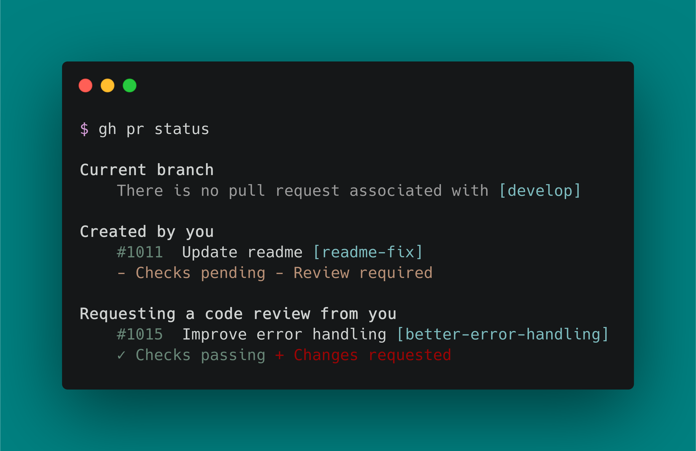

[回到首页](../README.md)

# git常用命令

[TOC]

## 1、常见工作流程

## 2、撤销改动

### 2.1、修改在工作区：已修改，未add

```
git checkout -- aaa.txt bbb.txt
git checkout -- *
git checkout -- *.txt
```

### 2.2、修改在暂存区：已add，未commit

```
git reset HEAD aaa.txt bbb.txt
git reset HEAD *
git reset HEAD *.txt
```

### 2.3、修改已提交到本地仓库：已commit

```
#回退到上一个版本
git reset --hard HEAD^
#回退到上上次版本
git reset --hard HEAD^^
git reset --hard HEAD^^^

#回退到指定commitid的版本（git log或git reflog获取）
git reset --hard  commit-id
```


## 3、git客户端

#### 3.1、[GitHub CLI](https://github.com/cli/cli#github-cli)，GitHub官方命令行工具



#### 3.2、[Fork](https://git-fork.com/)，Window和mac os下的桌面客户端


