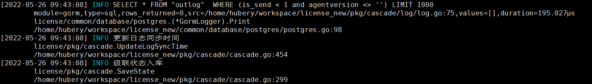

[回到首页](../README.md)

# 1. Go基础

说明

[TOC]

## 1.1. 变量声明与初始化

### 1.1.1. 类型

基础类型：

- 布尔：bool
- 整型：int8 | byte | int16 | int | uint | intptr ...
- 浮点：float32 | float64
- 复数：complex64 | complex128
- 字符串：string
- 字符：rune
- 错误：error

复合类型：

- 指针：pointer
- 数组：array
- 切片：slice
- 字典：map
- 通道：chan
- 结构体：struct
- 接口：interface

### 1.1.2. 声明与初始化

声明方式：

```go
var val int
```

初始化方式：

```go
val := 100
```

大部分类型在声明时会被系统初始化为零值，整型零值是0，字符串零值是空字符串，布尔零值是false

指针类型不会被自动初始化，不能直接使用，比如：

```go
	var t1 map[int]int
	// t1 = make(map[int]int) // 正确初始化
	t1[2] = 2 // panic
	fmt.Println("t1", t1)


	var t5 *int
	// t5 = new(int) // 正确初始化
	*t5 = 1 // panic
	fmt.Println("t5", *t5)
```

### 1.1.3. var、new与make在初始化时的使用区别

var用于类型声明，对于基本类型会被初始化为零值，包括整型、字符串、array、struct等

new用于指定类型的内存创建，同时把内存置为零值，返回的是内存地址。`map, slice,chan`的零值是nil

make用于`map, slice,chan` 的内存创建，返回的对象是类型本身。创建内存不会初始化为零值，意味着对象一定不是nil


## 1.2. 字符串

重复：`strings.Repeat()`

分割：`strings.Split()`

连接：`strings.Join()`

> 参考：[Go内置常用包](https://www.cnblogs.com/52fhy/p/11295090.html)

## 1.3. 类型判断

### 1.3.1. switch

```go
for k, v := range user5 {
    switch v2 := v.(type) {
        case string:
        fmt.Println(k, "is string", v2)
        case int:
        fmt.Println(k, "is int", v2)
        case bool:
        fmt.Println(k, "is bool", v2)
        case []interface{}:
        fmt.Println(k, "is an array:")
        for i, iv := range v2 {
            fmt.Println(i, iv)
        }
        default:
        fmt.Println(k, "类型未知")
    }
}
```


### 1.3.2. reflect反射

## 1.4. 类型转换

### 1.4.1. 整型与字符串互转

```go
// string转成int
int, err := strconv.Atoi(string)

// string转成int64
int64, err := strconv.ParseInt(string, 10, 64)

// int转成string
string := strconv.Itoa(int)

// int64转成string
string := strconv.FormatInt(int64, 10)
```

注意，go不支持强制转换，使用string()会得到意想不到的结果

```go
s := string(97) // s == "a"
```


## 1.5. 正则

### 1.5.1. 正则匹配

```go
name := regexp.MustCompile("[\u4e00-\u9fa5~!@#$%^&*(){}|<>\\\\/+\\-【】:\"?'：；‘’“”，。、《》\\]\\[`]")
if name.MatchString(param["username"]) {
    return errors.New("添加失败, 名字中含有特殊字符或有中文")
}
```

### 1.5.2. 正则查找子串

```go
re := regexp.MustCompile(`<!--{{TPL_LIST_ITEM_START}}-->([\s\S]*?)<!--{{TPL_LIST_ITEM_END}}-->`)
matches := re.FindSubmatch([]byte(tplContent))
tplListItem := ""
if len(matches) > 1 {
    tplListItem = string(matches[1])
} else {
    err = errors.New("模板错误")
    return
}
```

### 1.5.3. 替换

```go
re, _ := regexp.Compile("a");
rep := re.ReplaceAllStringFunc("abcd", strings.ToUpper);
fmt.Println(rep) // Abcd
```


## 1.6. 时间

### 1.6.1. `time.Now()`返回的是什么？

返回的是当前时间的`time.Time`对象。

### 1.6.2. 获取当前时间的时间戳

```go
time.Now().Unix() // 1653194203
```

### 1.6.3. 时间格式化

```go
const TimeFormat = "2006-01-02 15:04:05"
time.Now().Format(TimeFormat)
```

### 1.6.4. 时间字符串生成时间对象，时间戳生成时间对象

```go
const TimeFormat = "2006-01-02 15:04:05"
time.Unix(1653194203, 0)
fmt.Println(time.Parse(TimeFormat, "2022-04-07 06:43:27"))
```


例：

```go
fmt.Println(time.Now())
// 时间偏移
fmt.Println(time.Now().Add(-10 * time.Minute).Format("2006-01-02 15:04:05"))

// 时间戳生成time
fmt.Println(time.Unix(1649313807, 0))
// 时间字符串生成time
fmt.Println(time.Parse("2006-01-02 15:04:05", "2022-04-07 06:43:27"))
```

输出结果，注意时区的区别

```bash
2022-04-07 14:47:58.162877786 +0800 CST m=+0.014919095
2022-04-07 14:37:58
2022-04-07 14:43:27 +0800 CST
2022-04-07 06:43:27 +0000 UTC <nil>
```


## 1.7. 文件

touch文件：

```go
os.OpenFile(filename, os.O_RDONLY|os.O_CREATE, 0666)
```


## 1.8. 协程

## 1.9. dlv调试

### 1.9.1. 调试时带上命令行参数，`--`后带上参数

```bash
dlv debug main.go --output ./bin/license -- -c ./etc/license.json
dlv exec ./bin/license -- -c ./etc/license.json
```

### 1.9.2. 设置字符串可显示长度

```
config max-string-len 99999
```

### 1.9.3. 常用命令

```
// 打断点
b main.main
b main.go:18
// 查看断点
breakpoints/bp
// 清除断点
clear 1
// 清除所有断点
clearall
// 启用禁用断点
toggle 1
// 下一步
next/n
// 跳入
step/s
// 跳出
stepout
// 继续
continue/c
// 在断点执行命令
on 1 p i
// 有条件中断断点
condition 1 i==10
// 查看函数参数
args
// 查看所有局部变量
locals
// 打印源代码
list

// 显示协程
goroutines
// 切换协程
goroutine 1
// 显示线程
threads
// 跟踪，运行到此处时打印一条信息并继续
trace
```


## 1.10. 数据库事务处理

```go
db, err := postgreHelper.Open()
if err != nil {
    return err
}
defer postgreHelper.Close(db)
tx := db.Begin()
defer func() {
    if p := recover(); p != nil {
        tx.Rollback()
        panic(p)
    } else if err != nil {
        tx.Rollback()
    } else {
        err = tx.Commit().Error
    }
}()

// tx.Exec()...
```

> 参考：[Golang transaction 事务使用的正确姿势](http://www.mspring.org/2019/03/18/Golang-transaction-事务使用的正确姿势/)

## 1.11. 闭包

```go
package main

import "fmt"

func main() {
    a := Fun()
    b:=a("hello ")
    c:=a("hello ")
    fmt.Println(b)//worldhello 
    fmt.Println(c)//worldhello hello 
}
func Fun() func(string) string {
    a := "world"
    return func(args string) string {
        a += args
        return  a
    }
}
```

## 1.12. 并发锁 sync.Mutex与sync.RWMutex

Mutex是单读写模型，一旦被锁，其他goruntine只能阻塞不能读写

RWMutext是单写多读模型，读锁（RLock）占用时会阻止写，不会阻止读；写锁（Lock）占用时会阻止读和写

## 1.13. 使用避坑

```go
package main

import "fmt"

var AppPath = "/opt/topsec/topihs"
func init() {
    AppPath, err := GetAppPath()
	if err != nil {
		panic(err)
	}
    fmt.Println("AppPath1", AppPath)
}

func GetAppPath() (string, error) {
	return ""/opt/topsec"", nil
}

func main() {
    fmt.Println("AppPath2", AppPath)
}
```

这里输出 /opt/topsec/topihs，因为init中的AppPath会当作一个局部变量。正确的写法是

```go
func init() {
    var err error
    AppPath, err = GetAppPath()
	if err != nil {
		panic(err)
	}
}
```

## 1.14. map并发问题

并发写一个map会出现问题，运行时报错：`fatal error: concurrent map read and map write`

有两个解决方法：

1、sync.RWMutex

```go
type Pool struct {
	sync.RWMutex
	m map[string]int
}

func NewPool() Pool {
	return Pool{
		m: make(map[string]int),
	}
}

func (p Pool) Set(tag string, item int) {
	p.Lock()
	defer p.Unlock()
	p.m[tag] = item
}

func (p Pool) Get(tag string) int {
	p.RLock()
	defer p.RUnlock()
	return p.m[tag]
}

func (p Pool) Range(f func(string, interface{}) bool) {
	p.RLock()
	defer p.RUnlock()
	for k, v := range p.m {
		if !f(k, v) {
			break
		}
	}
}
```

2、sync.Map

```go
var scene sync.Map

// 将键值对保存到sync.Map
scene.Store("greece", 97)
scene.Store("london", 100)
scene.Store("egypt", 200)

// 从sync.Map中根据键取值
fmt.Println(scene.Load("london"))

// 根据键删除对应的键值对
scene.Delete("london")

// 遍历所有sync.Map中的键值对
scene.Range(func(k, v interface{}) bool {
    fmt.Println("iterate:", k, v)
    return true
})
```

## 1.15. logrus使用

logrus是十分常用的第三方日志库，项目地址：[sirupsen/logrus: Structured, pluggable logging for Go](https://github.com/sirupsen/logrus)。其他常用日志库还有[Zerolog](https://github.com/rs/zerolog)、 [Zap](https://github.com/uber-go/zap)和[Apex](https://github.com/apex/log).

项目中任何输出应统一使用日志库，不应该使用print打印，包括第三方库如gorm.



### 1.15.1. 配置formater，指定日志输入格式

```go
type TopLog struct {
	*logrus.Logger
}

func NewLog(logType string, logPath string, logLevel string) (*TopLog, error) {
	logrusLevel, err := logrus.ParseLevel(logLevel)
	if err != nil {
		return nil, err
	}

	log = logrus.New()
	log.SetFormatter(&myFormatter{
		logrus.TextFormatter{
			DisableColors:   true,
			TimestampFormat: "2006-01-02 15:04:05",
			FullTimestamp:   true,
			DisableQuote:    true,
		},
	})
	log.SetReportCaller(true)
	log.SetOutput(os.Stdout)
	log.SetLevel(logrusLevel)

	return &TopLog{
		log,
	}, nil
}

func Logger() *logrus.Entry {
	entry := log.WithFields(logrus.Fields{})
	return entry
}

type myFormatter struct {
	logrus.TextFormatter
}

func (f *myFormatter) Format(entry *logrus.Entry) ([]byte, error) {
	// 给日志等级点颜色看看
	var levelColor int
	switch entry.Level {
	case logrus.DebugLevel, logrus.TraceLevel:
		levelColor = 31 // gray
	case logrus.WarnLevel:
		levelColor = 33 // yellow
	case logrus.ErrorLevel, logrus.FatalLevel, logrus.PanicLevel:
		levelColor = 31 // red
	default:
		levelColor = 36 // blue
	}

	var b *bytes.Buffer
	if entry.Buffer != nil {
		b = entry.Buffer
	} else {
		b = &bytes.Buffer{}
	}

	// 第一行 时间和消息
	b.WriteString(fmt.Sprintf("[%s] \x1b[%dm%s\x1b[0m %s", entry.Time.Format(f.TimestampFormat), levelColor, strings.ToUpper(entry.Level.String()), entry.Message))

	// 第二行 数据体，如有
	var dataStr []string
	for key, value := range entry.Data {
		dataStr = append(dataStr, fmt.Sprint(key, "=", value))
	}
	if len(dataStr) > 0 {
		b.WriteString("\n\t" + strings.Join(dataStr, ","))
	}

	// 第三行和第四行 调用方法和文件，如有
	var funcVal, fileVal string
	if entry.HasCaller() {
		if f.CallerPrettyfier != nil {
			funcVal, fileVal = f.CallerPrettyfier(entry.Caller)
		} else {
			funcVal = entry.Caller.Function
			fileVal = fmt.Sprintf("%s:%d", entry.Caller.File, entry.Caller.Line)
		}
	}
	if funcVal != "" {
		b.WriteString(fmt.Sprintf("\n\t%s", funcVal))
	}
	if fileVal != "" {
		b.WriteString(fmt.Sprintf("\n\t%s", fileVal))
	}

	b.WriteByte('\n')
	return b.Bytes(), nil
}
```

### 1.15.2. 配置gorm使用logrus

```go
type Database struct {
	*gorm.DB
	Error error
}

type Host struct {
	Database  string       `json:"database"`
	Password  string       `json:"password"`
	Host      string       `json:"host"`
	User      string       `json:"user"`
	Port      string       `json:"port"`
	DebugMode bool         `json:"-,optional"`
	Logger    *gorm.Logger `json:"-,optional"`
}

var (
	db   *Database
	once sync.Once
)

func DB() *gorm.DB {
	return db.DB
}

func Open(host Host) (*Database, error) {
	once.Do(
		func() {
			db = new(Database)
			db.connect(host)
		})
	return db, db.Error
}

// 只可关闭一次
func (db *Database) Close() {
	if db.DB != nil {
		_ = db.DB.Close()
		db.DB = nil
	}

	return
}

// 连接数据库
func (db *Database) connect(host Host) {
	var err error

	dbDSN := fmt.Sprintf(`host=%s user=%s password=%s database=%s port=%s sslmode=disable`,
		host.Host, host.User, host.Password, host.Database, host.Port)
	db.DB, err = gorm.Open("postgres", dbDSN)
	if err != nil {
		db.Error = err
		return
	}

	db.DB.LogMode(host.DebugMode)
	if host.Logger != nil {
		db.DB.SetLogger(*host.Logger)
	} else {
		db.DB.SetLogger(&GormLogger{})
	}

	db.DB.DB().SetMaxIdleConns(5)
	db.DB.DB().SetMaxOpenConns(20)
	db.SingularTable(true)

	return
}

type GormLogger struct{}

func (*GormLogger) Print(v ...interface{}) {
	log := runlog.Logger()
	switch v[0] {
	case "sql":
		log.WithFields(
			logrus.Fields{
				"module":        "gorm",
				"type":          "sql",
				"rows_returned": v[5],
				"src":           v[1],
				"values":        v[4],
				"duration":      v[2],
			},
		).Info(v[3])
	case "log":
		log.WithFields(logrus.Fields{"module": "gorm", "type": "log"}).Print(v[2])
	}
}
```

## 1.16. 性能测试pprof

## 1.17. 性能优化

### 1.17.1. 读取上传的xml文件并解析时，造成大量内存占用且长时间不能释放

优化前，直接把上传的文件读到内存并解析

```go
xmlFile, e := os.Open(f)
if e != nil {
    return e
}

defer xmlFile.Close()

b, _ := ioutil.ReadAll(xmlFile)

var xmlHead XmlHeadStruct

reader := bytes.NewReader(b)
decoder := xml.NewDecoder(reader)
decoder.CharsetReader = charset.NewReader

if e = decoder.Decode(&xmlHead); e != nil {
    return e
}
```

使用io.buffer

```go
f, _ := os.Open(fname)
defer f.Close()

var head XmlHeadStruct
decoder := xml.NewDecoder(bufio.NewReader(f))
_ = decoder.Decode(&head)

```

> 参考：
>
> 1、[XML parsing and memory usage : golang (reddit.com)](https://www.reddit.com/r/golang/comments/7a4dxw/xml_parsing_and_memory_usage/)
>
> 2、[go - How to read multiple times from same io.Reader - Stack Overflow](https://stackoverflow.com/questions/39791021/how-to-read-multiple-times-from-same-io-reader)

## 1.18. 多协程并发的优秀实现

几个原则：

- 保持自己忙碌或做自己的工作：如果当前方法启动了一个协程并立即等待，则应该让当前方法去做协程里的事情
- 将并发性留给调用者
- 永远不要启动一个停止不了的goroutine

```go
func serve(addr string, handler http.Handler, stop <-chan struct{}) error {
	s := http.Server{
		Addr:    addr,
		Handler: handler,
	}

	go func() {
		<-stop // wait for stop signal
		s.Shutdown(context.Background())
	}()

	return s.ListenAndServe()
}

func serveApp(stop <-chan struct{}) error {
	mux := http.NewServeMux()
	mux.HandleFunc("/", func(resp http.ResponseWriter, req *http.Request) {
		fmt.Fprintln(resp, "Hello, QCon!")
	})
	return serve("0.0.0.0:8080", mux, stop)
}

func serveDebug(stop <-chan struct{}) error {
	return serve("127.0.0.1:8001", http.DefaultServeMux, stop)
}

func main() {
	done := make(chan error, 2)
	stop := make(chan struct{})
	go func() {
		done <- serveDebug(stop)
	}()
	go func() {
		done <- serveApp(stop)
	}()

	var stopped bool
	for i := 0; i < cap(done); i++ {
		if err := <-done; err != nil {
			fmt.Println("error: %v", err)
		}
		if !stopped {
			stopped = true
			close(stop)
		}
	}
}
```

该实现中，任何一个服务遇到错误时另外一个服务都能干净地退出，由系统的进程管理器来重启

## 1.19. 错误处理

错误处理注意三点：

- 错误只处理一次，避免出现重复的日志
- 错误应该包含相关信息，从错误文字上就能大概判断错误位置
- 使用`github.com/pkg/errors`保留原始错误信息

```go
package main

import (
	"log"
	"os"

	"github.com/pkg/errors"
)

func testError() error {
	f, err := os.Open("/tmp/ll")
	if err != nil {
		//log.Printf("open failed: %s", err.Error()) // 1、错误交由调用者处理，避免处理/记录多次，此错误在main中已有处理
		return errors.Wrap(err, "open failed") // 2、为错误添加相关信息；3、另外，errors.Wrap保留了原始错误的信息
	}
	f.Close()
	return nil
}

func main() {
	err := testError()
	if err != nil {
		log.Printf("testError: %s", err.Error())
		log.Printf("original error: %T %v\n", errors.Cause(err), errors.Cause(err))
		log.Printf("stack trace:\n%+v\n", err)
		os.Exit(1)
	}
}
```

输出：

```bash
 $ go run test.go
2022/06/05 00:01:16 testError: open failed: open /tmp/ll: no such file or directory
2022/06/05 00:01:16 original error: *fs.PathError open /tmp/ll: no such file or directory
2022/06/05 00:01:16 stack trace:
open /tmp/ll: no such file or directory
open failed
main.testError
        /Volumes/FILE/Workspace/go_test/terror/test.go:14
main.main
        /Volumes/FILE/Workspace/go_test/terror/test.go:21
runtime.main
        /usr/local/Cellar/go/1.18.2/libexec/src/runtime/proc.go:250
runtime.goexit
        /usr/local/Cellar/go/1.18.2/libexec/src/runtime/asm_amd64.s:1571
exit status 1
```

## 1.10. go build参数

```
GOOS=linux GOARCH=amd64 CGO_ENABLED=0 go build -ldflags "-w -s" -gcflags "-N -l" -mod=vendor -o runtime/bin/license-srv cmd/main.go
```

1、gcflags编译参数：`go tool compile --help`查看可用参数

-N 禁用优化

-l 禁用内联

2、ldflags链接参数：`go tool link –help`查看可用参数

-w 禁用DWARF

-s 禁用符号表

## 1.11. go语言中init函数执行顺序

1. 如果一个包导入了其他包，则首先初始化导入的包。
2. 然后初始化当前包的常量。
3. 接下来初始化当前包的变量。
4. 最后，调用当前包的 `init()` 函数。

> 参考：[一张图了解 Go 语言中的 init () 执行顺序](https://learnku.com/go/t/47135)

## 1.12. context的使用

### 1.12.1. 停止协程

```go
package main

import (
    "context"
    "log"
    "os/exec"
    "sync"
    "time"
)

func Run(ctx context.Context) {
    cmd := exec.CommandContext(ctx, "sleep", "300")
    err := cmd.Start()
    if err != nil {
        // Run could also return this error and push the program
        // termination decision to the `main` method.
        log.Fatal(err)
    }

    err = cmd.Wait()
    if err != nil {
        log.Println("waiting on cmd:", err)
    }
}

func main() {
    var wg sync.WaitGroup
    ctx, cancel := context.WithCancel(context.Background())

    // Increment the WaitGroup synchronously in the main method, to avoid
    // racing with the goroutine starting.
    wg.Add(1)
    go func() {
        Run(ctx)
        // Signal the goroutine has completed
        wg.Done()
    }()

    <-time.After(3 * time.Second)
    log.Println("closing via ctx")
    cancel()

    // Wait for the child goroutine to finish, which will only occur when
    // the child process has stopped and the call to cmd.Wait has returned.
    // This prevents main() exiting prematurely.
    wg.Wait()
}
```

> 参考：[go - how to call cancel() when using exec.CommandContext in a goroutine](https://stackoverflow.com/questions/52346262/how-to-call-cancel-when-using-exec-commandcontext-in-a-goroutine)

## 1.13. 值类型、引用类型

golang中分为值类型和引用类型

值类型分别有：int系列、float系列、bool、string、数组和结构体

引用类型有：指针、slice切片、管道channel、接口interface、map、函数等

值类型的特点是：变量直接存储值，内存通常在栈中分配

引用类型的特点是：变量存储的是一个地址，这个地址对应的空间里才是真正存储的值，内存通常在堆中分配

## 1.14. go中函数传参都是值传递

> 参考：https://www.flysnow.org/2018/02/24/golang-function-parameters-passed-by-value

## 1.15. go build缓存目录

缓存目录：`~/.cache/go-build`，使用docker容器编译打包时将这个目录做个卷映射可加速编译

## 1.16. 命名规范

- 文件名全部小写，除单元测试外避免使用下划线
- 变量名、常量、函数名使用驼峰式命名，不建议使用下划线和数字

> 参考：[命名规范 | go-zero](https://go-zero.dev/cn/docs/develop/naming-spec/)

# 2. 第三方包

## 2.1. Gorm

相对更新：

```go
Db.Model(xy).Where("id = ? ", id).Update("sign_up_num", gorm.Expr("sign_up_num+ ?", 1))
```

