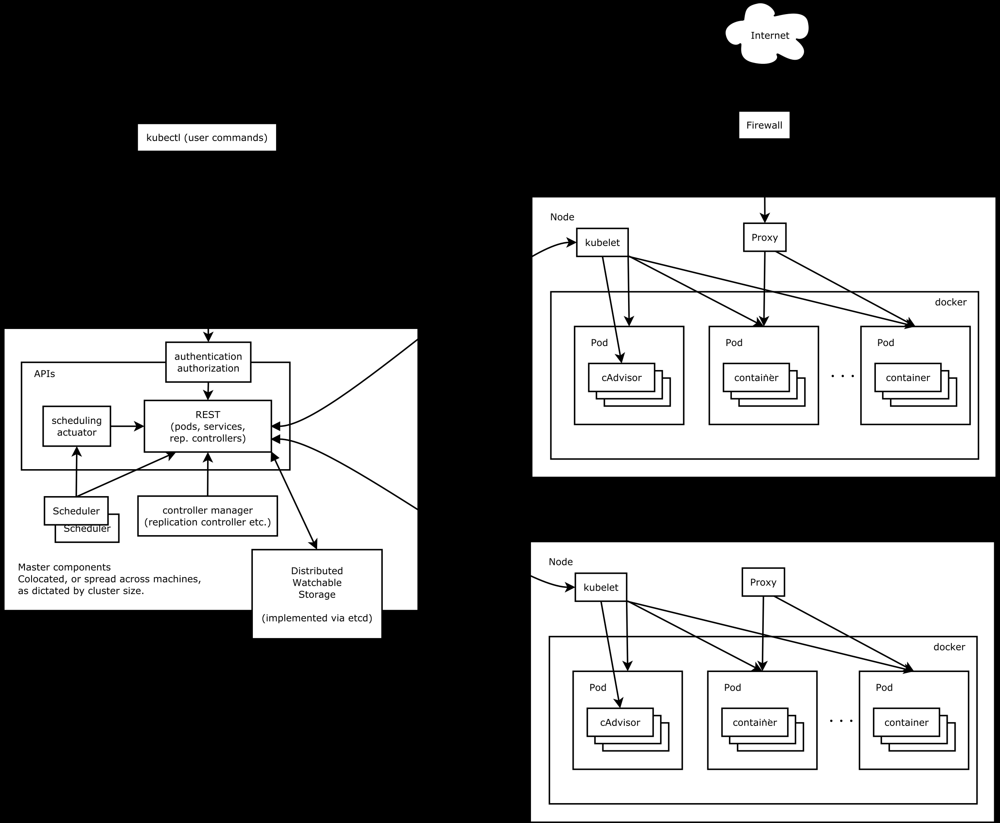

[回到首页](../README.md)

# 1. kubernetes


[TOC]

## 1.1. 基本概念




### 组件

Kubernetes主要由以下几个核心组件组成：

- etcd保存了整个集群的状态；
- apiserver提供了资源操作的唯一入口，并提供认证、授权、访问控制、API注册和发现等机制；
- controller manager负责维护集群的状态，比如故障检测、自动扩展、滚动更新等；
- scheduler负责资源的调度，按照预定的调度策略将Pod调度到相应的机器上；
- kubelet负责维护容器的生命周期，同时也负责Volume（CVI）和网络（CNI）的管理；
- Container runtime负责镜像管理以及Pod和容器的真正运行（CRI）；
- kube-proxy负责为Service提供cluster内部的服务发现和负载均衡；

除了核心组件，还有一些推荐的Add-ons：

- kube-dns负责为整个集群提供DNS服务
- Ingress Controller为服务提供外网入口
- Heapster提供资源监控
- Dashboard提供GUI
- Federation提供跨可用区的集群
- Fluentd-elasticsearch提供集群日志采集、存储与查询


- 控制面调度整个集群

- 节点负责运行应用，是一个虚拟机或物理机。一个节点至少运行：1、Kubelet，负责Kubernetes 控制面和节点之间通信的进程；管理机器上运行的 Pod 和容器；2、容器运行时（如 Docker）负责从镜像仓库中提取容器镜像、解压缩容器以及运行应用

- 部署Deployment
- 代理proxy：可以通过代理访问代理访问Deployment
- 服务Service：定义了 Pod 的逻辑集和访问 Pod 的协议
- Pod：表示一组一个或多个应用容器（如 Docker），以及这些容器的一些共享资源
- ConfigMap 是一种 API 对象，用来将非机密性的数据保存到键值对中
- Secret 是一种包含少量敏感信息例如密码、令牌或密钥的对象
- ReplicaSet 的目的是维护一组在任何时候都处于运行状态的 Pod 副本的稳定集合
- StatefulSet用于管理有状态应用程序的工作负载 API 对象。pods不可相互替换，存在顺序，如数据库的主从
- **DaemonSet** 确保全部（或者某些）节点上运行一个 Pod 的副本
- Job 会创建一个或者多个 Pod，并将继续重试 Pod 的执行，直到指定数量的 Pod 成功终止
- Ingress 是对集群中服务的外部访问进行管理的 API 对象，典型的访问方式是 HTTP
- init容器
- sidecar容器

> 参考：[Kubernetes设计架构](https://www.kubernetes.org.cn/kubernetes设计架构)

## 1.1. 基本使用

### 1.1.1. 部署应用

run-my-nginx.yaml

```yaml
apiVersion: apps/v1
kind: Deployment
metadata:
  name: my-nginx
spec:
  selector:
    matchLabels:
      run: my-nginx
  replicas: 2
  template:
    metadata:
      labels:
        run: my-nginx
    spec:
      containers:
      - name: my-nginx
        image: nginx
        ports:
        - containerPort: 80
```

```bash
kubectl apply -f ./run-my-nginx.yaml

# 查看应用
kubectl get pods -l run=my-nginx -o wide

# 查看环境变量
kubectl exec my-nginx-646554d7fd-5d7bk -- printenv

# 查看容器日志
kubectl logs my-nginx-646554d7fd-5d7bk

# 查看 ReplicaSet 对象
kubectl get replicasets
kubectl describe replicasets
```

### 1.1.2. 创建服务

```bash
kubectl expose deployment/my-nginx
```

等效于

```bash
kubectl create -f nginx-svc.yaml
```

```yaml
apiVersion: v1
kind: Service
metadata:
  name: my-nginx
  labels:
    run: my-nginx
spec:
  ports:
  - port: 80
    protocol: TCP
  selector:
    run: my-nginx

```

```bash
# 查看服务
kubectl get svc my-nginx

# 查看详细信息
kubectl describe svc my-nginx

# 查看端点
kubectl get endpointslices -l kubernetes.io/service-name=my-nginx
```


### 1.1.3. 配置

创建配置：

```bash
kubectl apply -f example-redis-config.yaml
# 查看配置
kubectl describe configmap/example-redis-config
```

```yaml
apiVersion: v1
kind: ConfigMap
metadata:
  name: example-redis-config
data:
  redis-config: |
    maxmemory 2mb
    maxmemory-policy allkeys-lru    
```

redis使用该配置：

```bash
kubectl apply -f https://raw.githubusercontent.com/kubernetes/website/main/content/en/examples/pods/config/redis-pod.yaml
kubectl exec -it redis -- redis-cli
127.0.0.1:6379> CONFIG GET maxmemory
```


## 1.2. 无状态应用

无状态应用不需要持久化数据，方便水平扩展和故障恢复。


php+redis的留言板应用示例

```bash
# 创建redis部署
kubectl apply -f https://k8s.io/examples/application/guestbook/redis-leader-deployment.yaml
# 创建redis领导者服务
kubectl apply -f https://k8s.io/examples/application/guestbook/redis-leader-service.yaml

# 创建redis部署
kubectl apply -f https://k8s.io/examples/application/guestbook/redis-follower-deployment.yaml
# 创建redis追随者服务
kubectl apply -f https://k8s.io/examples/application/guestbook/redis-follower-service.yaml

# 创建 Guestbook 前端 Deployment
kubectl apply -f https://k8s.io/examples/application/guestbook/frontend-deployment.yaml
# 创建前端服务
kubectl apply -f https://k8s.io/examples/application/guestbook/frontend-service.yaml

# 转发开放端口，访问 http://localhost:8080
kubectl port-forward svc/frontend 8080:80

# 伸缩服务
kubectl scale deployment frontend --replicas=5
kubectl scale deployment frontend --replicas=2
```


> 参考：[示例：使用 Redis 部署 PHP 留言板应用程序 | Kubernetes](https://kubernetes.io/zh-cn/docs/tutorials/stateless-application/guestbook/)

## 1.3. 有状态应用

有状态应用依赖持久化的状态，这些状态需要在应用迁移、扩展和故障恢复时得到保留。

有状态应用通过持久卷或者StatefulSet来部署。


wordpress+mysql的博客应用示例


```bash
# 创建 PersistentVolumeClaims 和 PersistentVolumes

# 创建 Secret 生成器
cat <<EOF >./kustomization.yaml
secretGenerator:
- name: mysql-pass
  literals:
  - password=YOUR_PASSWORD
EOF

# 补充 MySQL 和 WordPress 的资源配置
curl -LO https://k8s.io/examples/application/wordpress/mysql-deployment.yaml
curl -LO https://k8s.io/examples/application/wordpress/wordpress-deployment.yaml
cat <<EOF >>./kustomization.yaml
resources:
  - mysql-deployment.yaml
  - wordpress-deployment.yaml
EOF

# 应用和验证
kubectl apply -k ./
kubectl get secrets
kubectl get pvc
kubectl get pods
kubectl get services wordpress
minikube service wordpress --url
# 访问上一步的地址
```


> 参考：[示例：使用持久卷部署 WordPress 和 MySQL | Kubernetes](https://kubernetes.io/zh-cn/docs/tutorials/stateful-application/mysql-wordpress-persistent-volume/)

# Istio服务网格

## 2.1. 功能

- 改进了调试：提供了类似链路跟踪的功能
- 监控和观测能力：观测流量，比如等待时间、服务时间、错误占比等
- 策略：限制服务间的相互协作
- 路由和负载均衡：可以实现蓝绿部署
- 回路中断：

> 参考：[什么是 Istio？ | IBM](https://www.ibm.com/cn-zh/topics/istio)