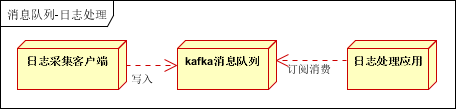

[回到首页](../README.md)

# 消息队列

消息队列的使用场景

[TOC]

## 1、使用场景

1.1、异步处理

比如，注册帐号后发送邮件或短信，使用异步处理去执行任务可提高系统吞吐量

 

1.2、应用解耦

一个应用的异常不会影响另一个应用。比如订单系统与库存系统，库存系统挂掉之后应不影响正常的下单操作

 

1.3、流量削峰

比如，秒杀系统，一般会因为流量过大，导致流量暴增，应用挂掉。为解决这个问题，一般需要在应用前端加入消息队列

 

- 可以控制活动的人数
- 可以缓解短时间内高流量压垮应用
- 用户的请求，服务器接收后，首先写入消息队列。假如消息队列长度超过最大数量，则直接抛弃用户请求或跳转到错误页面
- 秒杀业务根据消息队列中的请求信息，再做后续处理

1.4、日志处理

日志处理是指将消息队列用在日志处理中，比如Kafka的应用，解决大量日志传输的问题。架构简化如下

 

- 日志采集客户端，负责日志数据采集，定时写受写入Kafka队列
- Kafka消息队列，负责日志数据的接收，存储和转发
- 日志处理应用：订阅并消费kafka队列中的日志数据

1.5、消息通讯

## 2、常用消息队列

### 2.1、Kafka

### 2.2、RabbitMQ

**RabbitMQ**是实现了[高级消息队列协议](https://zh.wikipedia.org/wiki/高级消息队列协议)（AMQP）的开源[消息代理](https://zh.wikipedia.org/wiki/消息代理)软件

官方文档：[RabbitMQ Tutorials — RabbitMQ](https://www.rabbitmq.com/getstarted.html)

特性：

- 可伸缩性：集群服务
- 消息持久化：从内存持久化消息到硬盘，再从硬盘加载到内存

打印出未ack的队列任务

```bash
sudo rabbitmqctl list_queues name messages_ready messages_unacknowledged
```

打印excahnges

```bash
sudo rabbitmqctl list_exchanges
```

列出绑定

```bash
sudo rabbitmqctl list_bindings
```

**与redis作为消息队列时的区别**，为什么一般会选择rabbitmq？

redis的list设计简单，没有保证消费的机制，一旦消费失败，消息丢失。而rabbitmq会使失败的消息自动回到原队列

redis： 轻量级，低延迟，高并发，低可靠性；

rabbitmq：重量级，高可靠，异步，不保证实时；

> 参考：[Redis 与 MQ 的区别](https://www.cnblogs.com/dengguangxue/p/11537466.html)

## 3、应用实例

> 参考：
>
> 1、[消息队列使用的四种场景介绍 - 杨浪 - 博客园 (cnblogs.com)](https://www.cnblogs.com/yanglang/p/9259172.html)

