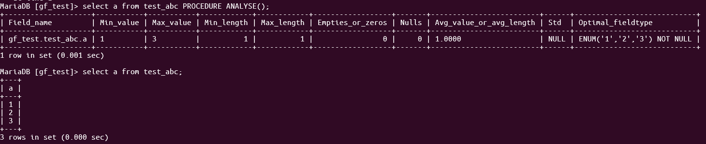

[回到首页](../README.md)

# 1. MySQL基础

[TOC]

## 1.1. 查看所有表信息

```bash
##查看所有表信息
SELECT * FROM information_schema.TABLES WHERE TABLE_SCHEMA = 'apyun'
##查看各个表数据量
SELECT table_name,table_rows FROM information_schema.tables
WHERE TABLE_SCHEMA = 'apyun' ORDER BY table_rows DESC;
```

## 1.2. 导入导出数据

```bash
# 导出表结构
mysqldump -uroot -p -d dbname > dbname.sql
# 导出表数据
mysqldump -uroot -p -t dbname > dbname.sql
# 导出表结构和表数据
mysqldump -uroot -p dbname > dbname.sql
# 导出时指定表
mysqldump -uroot -p dbname --tables tbname1 tbname2 > dbname.sql
# 导出时过滤表
mysqldump -uroot -p dbname --ignore-table=dbname.tbname --ignore-table=dbname.tbname2 > dbname.sql
```

```sql
# 导入
CREATE DATABASE dbname DEFAULT CHARACTER SET utf8 COLLATE utf8_general_ci;
mysql -uroot -p dbname < /path/dbname.sql
# 或者
source dbname.sql

# 导出select后的数据，可用于导出成csv格式
SELECT * INTO OUTFILE '/home/temp.txt'
FIELDS TERMINATED BY ',' OPTIONALLY ENCLOSED BY '"' LINES TERMINATED BY '\n'
FROM table_name
WHERE createtime < 1382716800;

# 导入select后的数据
LOAD DATA INFILE '/home/temp.txt'
INTO TABLE table_name
FIELDS TERMINATED BY ',' OPTIONALLY ENCLOSED BY '"' LINES TERMINATED BY '\n'
(product_id,uuid,mac,monitor,win_version,ip,createtime);
# 注：从本地导入远程服务器需使用LOAD DATA LOCAL INFILE
```

`SELECT ... INTO OUTFILE`导出的结果会放到mysql服务器端，所以实际少用。

```sql
mysql -uroot -p dbname -e 'SELECT * FROM table_name WHERE create_time < 1382716800' -N -s > /home/temp.txt
```

> 注：
>
> - -e：执行sql命令
> - -N：去掉抬头
> - -s：去掉标准的分割线

## 1.3. 数据类型

### 1.3.1. 数字型

| **类型**     | **大小**                                 | **范围（有符号）**                                           | **范围（无符号）**                                           | **用途**        |
| ------------ | ---------------------------------------- | ------------------------------------------------------------ | ------------------------------------------------------------ | --------------- |
| TINYINT      | 1 字节                                   | (-128，127)                                                  | (0，255)                                                     | 小整数值        |
| SMALLINT     | 2 字节                                   | (-32 768，32 767)                                            | (0，65 535)                                                  | 大整数值        |
| MEDIUMINT    | 3 字节                                   | (-8 388 608，8 388 607)                                      | (0，16 777 215)                                              | 大整数值        |
| INT或INTEGER | 4 字节，2^32                             | (-2 147 483 648，2 147 483 647)                              | (0，4 294 967 295)                                           | 大整数值        |
| BIGINT       | 8 字节                                   | (-9 233 372 036 854 775 808，9 223 372 036 854 775 807)      | (0，18 446 744 073 709 551 615)                              | 极大整数值      |
| FLOAT        | 4 字节                                   | (-3.402 823 466 E+38，1.175 494 351 E-38)，0，(1.175 494 351 E-38，3.402 823 466 351 E+38) | 0，(1.175 494 351 E-38，3.402 823 466 E+38)                  | 单精度 浮点数值 |
| DOUBLE       | 8 字节                                   | (1.797 693 134 862 315 7 E+308，2.225 073 858 507 201 4 E-308)，0，(2.225 073 858 507 201 4 E-308，1.797 693 134 862 315 7 E+308) | 0，(2.225 073 858 507 201 4 E-308，1.797 693 134 862 315 7 E+308) | 双精度 浮点数值 |
| DECIMAL      | 对DECIMAL(M,D) ，如果M>D，为M+2否则为D+2 | 依赖于M和D的值                                               | 依赖于M和D的值                                               | 小数值          |

无符号整数用法:

```sql
CREATE TABLE t7(
    id INT AUTO_INCREMENT PRIMARY KEY,
    url VARCHAR(40),
    crcurl INT UNSIGNED NOT NULL DEFAULT 0
);
```

### 1.3.2. 字符类型

| CHAR       | 0-255字节             | 定长字符串                      |
| ---------- | --------------------- | ------------------------------- |
| VARCHAR    | 0-255字节/0-65535字节 | 变长字符串                      |
| TINYBLOB   | 0-255字节             | 不超过 255 个字符的二进制字符串 |
| TINYTEXT   | 0-255字节             | 短文本字符串                    |
| BLOB       | 0-65 535字节          | 二进制形式的长文本数据          |
| TEXT       | 0-65 535字节          | 长文本数据                      |
| MEDIUMBLOB | 0-16 777 215字节      | 二进制形式的中等长度文本数据    |
| MEDIUMTEXT | 0-16 777 215字节      | 中等长度文本数据                |
| LOGNGBLOB  | 0-4 294 967 295字节   | 二进制形式的极大文本数据        |
| LONGTEXT   | 0-4 294 967 295字节   | 极大文本数据                    |

### 1.3.3. 枚举集合

ENUM （最多65535个成员）                    64KB
SET （最多64个成员）                      64KB

### 1.3.4. 时间类型

一般用datetime和bigint存储时间戳，不受时区影响。

| **类型**  | **大小 (字节)** | **范围**                                | **格式**            | **用途**                 |
| --------- | --------------- | --------------------------------------- | ------------------- | ------------------------ |
| DATE      | 3               | 1000-01-01/9999-12-31                   | YYYY-MM-DD          | 日期值                   |
| TIME      | 3               | '-838:59:59'/'838:59:59'                | HH:MM:SS            | 时间值或持续时间         |
| YEAR      | 1               | 1901/2155                               | YYYY                | 年份值                   |
| DATETIME  | 8               | 1000-01-01 00:00:00/9999-12-31 23:59:59 | YYYY-MM-DD HH:MM:SS | 混合日期和时间值         |
| TIMESTAMP | 4               | 1970-01-01 00:00:00/2037 年某时         | YYYYMMDD HHMMSS     | 混合日期和时间值，时间戳 |

### 1.3.5. 类型实际应用

1、时间戳应该用什么类型存储：TIMESTAMP 或 INT

> 参考：[前端 - MySQL 中存储时间的最佳实践](https://segmentfault.com/a/1190000040270268)

## 1.4. MySQL官方示例数据库

[MySQL :: Other MySQL Documentation](https://dev.mysql.com/doc/index-other.html)

## 1.5. 数据库设计三大范式

1. 第一范式(确保每列保持原子性)

   所有字段值都是不可分解的原子值

2. 第二范式(确保表中的每列都和主键相关)

   第二范式在第一范式的基础之上更进一层。第二范式需要确保数据库表中的每一列都和主键相关，而不能只与主键的某一部分相关（主要针对联合主键而言）。也就是说在一个数据库表中，一个表中只能保存一种数据，不可以把多种数据保存在同一张数据库表中。

3. 第三范式(确保每列都和主键列直接相关,而不是间接相关)

   第三范式需要确保数据表中的每一列数据都和主键直接相关，而不能间接相关。

优点：采用范式可以降低数据的冗余性。

缺点：获取数据时，需要通过Join拼接出最后的数据。

> 参考：
>
> 1、[数据库设计三大范式 - Ruthless - 博客园 (cnblogs.com)](https://www.cnblogs.com/linjiqin/archive/2012/04/01/2428695.html)
>
> 2、[数据库逻辑设计之三大范式通俗理解，一看就懂，书上说的太晦涩 - SegmentFault 思否](https://segmentfault.com/a/1190000013695030)

## 1.6. 哪些列适合创建索引

1. 在where条件常使用的字段 。
2. 该字段的内容不是唯一的几个可选值，而是有较丰富的取值选项的字段 。
3. 该字段内容不是频繁变化的。

## 1.7. 常见配置项

query_cache_type

innodb_buffer_pool_size

insert_pool

## 1.8. 常见的SQL考题

### 1.8.1. 有一个学生选修课程的数据表，查询选修了多门课程的人数

course：stu_id, course_name

```sql
select count(stu_id)
from course
group by stu_id
having count(course_name) > 1
```

## 1.9. 日志

错误日志、查询日志、慢查询日志、redo log、undo log、binlog

## 1.10. DDL与DML

DDL（Data Definition Language）数据定义语言，用于定义和管理数据库的结构和模式，包括表、列、索引、视图等。

DML（Data Manipulation Language）数据操纵语言，用于操作和处理数据库中的数据。

# 2. 数据库事务的概念

## 2.1. 事务的四个隔离级别

- 未提交读
- 已提交读
- 可重复读（默认）
- 串行化

**脏读**：脏读就是指当一个事务正在访问数据，并且对数据进行了修改，而这种修改还没有提交到数据库中，这时，另外一个事务也访问这个数据，然后使用了这个数据。因为这个数据是还没有提交的数据，那么另外一个事务读到的这个数据是脏数据，依据脏数据所做的操作可能是不正确的。

**幻读**：幻读是指当事务不是独立执行时发生的一种现象。事务A读取与搜索条件相匹配的若干行。事务B以插入或删除行等方式来修改事务A的结果集，然后再提交。

简单来说，**幻读是在一个事务中前后两次读的数据不一致**，由于其他事务插入了行。解决方式：innodb加入了间隙锁，在`select ... for update`和`select ... lock in share mode`时阻止行前后插入数据。

MySQL InnoDB 引擎的可重复读隔离级别（默认隔离级），根据不同的查询方式，分别提出了避免幻读的方案：

-   针对**快照读**（普通 select 语句），是通过 MVCC 方式解决了幻读。
-   针对**当前读**（select ... for update 等语句），是通过 next-key lock（记录锁+间隙锁）方式解决了幻读。

> 参考：
> 
> 1、[彻底理解事务的4个隔离级别](https://www.cnblogs.com/jycboy/p/transaction.html)
> 
> 2、[MySQL是如何实现可重复读的?](https://juejin.cn/post/6844904180440629262)
> 
> 3、[MySQL 可重复读隔离级别，完全解决幻读了吗？](https://xiaolincoding.com/mysql/transaction/phantom.html#%E5%BD%93%E5%89%8D%E8%AF%BB%E6%98%AF%E5%A6%82%E4%BD%95%E9%81%BF%E5%85%8D%E5%B9%BB%E8%AF%BB%E7%9A%84)

## 2.2. 事务的四个特性（ACID）

- 原子性（Atomicity）：一个事务（transaction）中的所有操作，或者全部完成，或者全部不完成
- 一致性（Consistency）：在事务开始之前和事务结束以后，数据库的完整性没有被破坏
- 隔离性（Isolation）：数据库允许多个并发事务同时对其数据进行读写和修改的能力，隔离性可以防止多个事务并发执行时由于交叉执行而导致数据的不一致
- 持久性（Durability）：事务处理结束后，对数据的修改就是永久的，即便系统故障也不会丢失


# 3. MySQL高级

## 3.1. 分区

指将同一表中不同行的记录分配到不同的物理文件中，几个分区就有几个.idb文件

**使用场景**：一张表的查询速度慢到影响使用；对数据的查询只是特定一部分（热点数据）

**目的**：减少一次查询需要扫描的数据量

**缺点**：

目前MySQL支持一下几种类型的分区，RANGE分区，LIST分区，HASH分区，KEY分区。如果表存在主键或者唯一索引时，分区列必须是唯一索引的一个组成部分。实战十有八九都是用RANGE分区。

1.1 RANGE分区

RANGE分区是实战最常用的一种分区类型，行数据基于属于一个给定的连续区间的列值被放入分区。

当插入的数据不在一个分区中定义的值的时候，会抛异常

```sql
CREATE TABLE `m_test_db`.`Order` (
  `id` INT NOT NULL AUTO_INCREMENT,
  `partition_key` INT NOT NULL,
  `amt` DECIMAL(5) NULL,
  PRIMARY KEY (`id`, `partition_key`)
) PARTITION BY RANGE(partition_key) PARTITIONS 5( PARTITION part0 VALUES LESS THAN (201901),  PARTITION part1 VALUES LESS THAN (201902),  PARTITION part2 VALUES LESS THAN (201903),  PARTITION part3 VALUES LESS THAN (201904),  PARTITION part4 VALUES LESS THAN (201905)) ;
```

1.2 LIST分区

LIST分区和RANGE分区很相似，只是分区列的值是离散的，不是连续的。LIST分区使用VALUES IN，因为每个分区的值是离散的，因此只能定义值。

1.3 HASH分区

说到哈希，那么目的很明显了，将数据均匀的分布到预先定义的各个分区中，保证每个分区的数量大致相同。

1.4 KEY分区

KEY分区和HASH分区相似，不同之处在于HASH分区使用用户定义的函数进行分区，KEY分区使用数据库提供的函数进行分区。


> 参考：[搞懂MySQL分区](https://www.cnblogs.com/GrimMjx/p/10526821.html)

## 3.2. 分库分表

**使用场景**：一张表的查询速度慢到影响使用；频繁写入影响查询（并发锁）

**目的**：减少一次查询需要扫描的数据量；减少数据写入对查询的影响

**缺点**：增加了编码的复杂度，查询时需要先找出特定表，多个表需要联合查询

分布式事务：柔性事务是目前主流的方案，TCC模式就属于柔性事务。

> 参考：[MySql分库分表与分区的区别和思考](https://www.cnblogs.com/GrimMjx/p/11772033.html)


### 水平分表

- 数据量过大
- 高并发读写请求
- 数据归档和历史数据管理
- 地域分布式存储

### 垂直分表

- 频繁更新的列：当一个表中包含了一些频繁更新的列，但是其他列的更新频率较低，可以考虑将这些频繁更新的列拆分到一个单独的表中，从而减少锁竞争和提高更新效率
- 大对象：当一个表中包含了大对象（如大文本、大型二进制数据等），但是这些大对象并不是所有查询都需要的，可以考虑将这些大对象拆分到一个单独的表中，从而减少主表的数据量和提高查询效率

## 3.3. 读写分离

使用代理中间件，如：**ProxySQL**、**MaxScale**、**Tungsten Proxy**、**MySQL Router**

## 3.4. 主从复制原理

`binlog` -> 主节点 `log dump thread` 线程-> 从节点I/O线程 -> `relay log` -> 从节点sql线程重放sql

## 3.5. Mycat中间件

官网地址：[Mycat1.6](http://www.mycat.org.cn/)

支持读写分离，分库分表

使用haproxy+keepalived实现高可用

> 参考：
>
> 1、[分库分表中间件工具](https://www.jianshu.com/p/b1395b680818)
>
> 2、[GitHub - MyCATApache/Mycat-Server](https://github.com/MyCATApache/Mycat-Server)
>
> 3、[Mycat安装与配置](https://segmentfault.com/a/1190000022888772)
>
> 4、[mysql读写分离优缺点](https://zhuanlan.zhihu.com/p/358474872)

## 3.6. 常见问题

### 3.6.1. 什么情况下会生成临时表

1. UNION查询；
2. 用到TEMPTABLE算法或者是UNION查询中的视图；
3. ORDER BY和GROUP BY的子句不一样时；
4. 表连接中，ORDER BY的列不是驱动表中的；
5. DISTINCT查询并且加上ORDER BY时；
6. SQL中用到SQL_SMALL_RESULT选项时；
7. FROM中的子查询；
8. 子查询或者semi-join时创建的表；

### 3.6.2. 什么情况下需要回表查询

回表查询：先定位主键值，再定位行记录，它的性能较扫一遍索引树更低。

索引覆盖：只需要在一棵索引树上就能获取SQL所需的所有列数据，无需回表，速度更快。explain的输出结果Extra字段为**Using index**时，能够触发索引覆盖。

>  参考：
>  [MySQL优化：如何避免回表查询？什么是索引覆盖？ (转) - myseries - 博客园 (cnblogs.com)](https://www.cnblogs.com/myseries/p/11265849.html)

### 3.6.3. 聚簇索引、非聚簇索引和辅助索引

- 聚簇索引：将数据存储与索引放到了一块，找到索引也就找到了数据。表数据按照索引的顺序来存储的，也就是说索引项的顺序与表中记录的物理顺序一致。
- 非聚簇索引：将数据存储与索引分开，叶结点包含索引字段值及指向数据页数据行的逻辑指针，其行数量与数据表行数据量一致。

>  参考：[浅谈聚簇索引与非聚簇索引 | Java 技术论坛 (learnku.com)](https://learnku.com/articles/50096)

### 3.6.4. MyISAM与InnoDB引擎适用场景，OLTP与OLAP的概念

OLTP（在线事务处理），如Blog、电子商务、网络游戏等；

OLAP（在线分析处理），如数据仓库、数据集市。

### 3.6.5. MyISAM为什么比InnoDB查询更快

MyISAM在查询主键和非主键时，速度都更快，因为MyISAM要维护的东西更少，比如：

1、数据块，InnoDB要缓存，MyISAM只缓存索引块， 这中间还有换进换出的减少；

2、InnoDB寻址要映射到块，再到行，MyISAM记录的直接是文件的OFFSET，定位比InnoDB要快

3、InnoDB还需要维护MVCC一致； 虽然你的场景没有，但他还是需要去检查和维护MVCC (Multi-Version Concurrency Control)多版本并发控制 。

> 参考：[MySQL中MyISAM为什么比InnoDB查询快](https://www.cnblogs.com/chingho/p/14798021.html)

### 3.6.6. MyISAM与InnoDB中B+树的区别

MyISAM的主索引和普通索引都是非聚族索引，叶子节点不会存放行数据，而是存放的**磁盘地址**

> 参考：
>
> 1、[Innodb和MyIsam在B+树中的区别是什么？](https://blog.csdn.net/weixin_42740530/article/details/106922905)
>
> 2、[MyISAM与InnoDB的索引结构](https://www.cnblogs.com/yuyafeng/p/11350873.html)

### 3.6.7. 行锁、表锁的使用

InnoDB的行锁是针对索引加的锁，不是针对记录加的锁。并且该索引不能失效，否则都会从行锁升级为表锁

- 行锁：

```sql
SET AUTOCOMMIT=0;
BEGIN;
select * from innodb_lock where id=4 for update;// 显式加行锁，须命中索引，不然升级为表锁
update innodb_lock set v='4001' where id=4;
COMMIT;

// 分析表锁定
show status like 'innodb_row_lock%';
```

- 表锁：

```sql
lock table myisam_lock read;// 显式加表锁，如果有意向锁则阻塞（行锁会产生意向锁）
...
unlock tables;

// 查看加锁情况
show open tables where in_use > 0;
// 查看表锁
show status like 'table_locks%';
```

> 参考：
> 
> 1、[MySQL 行锁 表锁机制](https://www.cnblogs.com/itdragon/p/8194622.html)
> 
> 2、[INNODB索引实现原理](https://blog.csdn.net/bohu83/article/details/81104432)
> 
> 3、[意向锁（Intention Locks）](https://www.cnblogs.com/nevererror/p/16251861.html)

### 3.6.8. B+树的结构

B+树的内部节点包括：Key键值，Index索引值
B+树的叶子节点包括：Key键值，Index索引值，Data数据
B+树的内部节点也可称为索引节点，叶子节点也可称为外部节点

> 参考：
> 
> [B+树结构参考](https://www.jianshu.com/p/b395a81d04ee)
> 
> [InnoDB一棵B+树可以存放多少行数据？](https://www.cnblogs.com/leefreeman/p/8315844.html)

### 3.6.9. Procedure Analyse优化表结构

MySQL 提供的一个用于分析表结构和数据分布的内置存储过程。它能够分析指定表中的列，并提供有关这些列的统计信息，例如建议的数据类型和值范围。`PROCEDURE ANALYSE`的语法如下：

```sql
SELECT ... FROM ... WHERE ... PROCEDURE ANALYSE([max_elements,[max_memory]])
```

`max_elements`:指定每列非重复值的最大值，当超过这个值的时候，MySQL不会推荐enum类型。（默认值256）

 `max_memory `（默认值8192）`analyse()`为每列找出所有非重复值所采用的最大内存大小。

执行返回中的Optimal_fieldtype列是mysql建议采用的列。

示例：




> 参考：
> [Procedure Analyse优化表结构 ](https://www.cnblogs.com/duanxz/p/3968639.html)

### 3.6.10. 索引的类型划分

#### 3.6.10.1. 按功能逻辑划分

普通索引、主键索引、唯一索引、全文索引

#### 3.6.10.2. 按物理实现划分

聚集索引、非聚集索引

#### 3.6.10.3. 按字段个数划分

单个索引、联合索引

#### 3.6.10.4. 按索引结构划分

常见的有：BTREE、RTREE、HASH、FULLTEXT、SPATIAL

> 参考：[MySQL索引方法 - 成九 - 博客园 (cnblogs.com)](https://www.cnblogs.com/luyucheng/p/6289048.html)

#### 3.6.10.5. 稀疏索引与稠密索引

MySQL中的普通索引是密集索引（dense index），而不是稀疏索引（sparse index）。密集索引中的每个索引条目对应于表中的每一行数据，而稀疏索引则允许索引条目与表中的数据行不是一对一的关系。

### 3.6.11. 什么场景下应该使用索引

#### 3.6.11.1. 推荐使用

- WHERE, GROUP BY, ORDER BY 子句中的字段

- 多个单列索引在多条件查询是只会有一个最优的索引生效，因此多条件查询中最好创建联合索引。

联合索引的时候必须满足最左匹配原则，并且最好考虑到 sql 语句的执行顺序，比如 WHERE a = 1 GROUP BY b ORDER BY c, 那么联合索引应该设计为 (a,b,c)，因为在上一篇文章 MySQL 基础语法 中我们介绍过，mysql 查询语句的执行顺序 WHERE > GROUP BY > ORDER BY。

- 多张表 JOIN 的时候，对表连接字段创建索引。

- 当 SELECT 中有不在索引中的字段时，会先通过索引查询出满足条件的主键值，然后通过主键回表查询出所有的 SELECT 中的字段，影响查询效率。因此如果 SELECT 中的内容很少，为了避免回表，可以把 SELECT 中的字段都加到联合索引中，这也就是宽索引的概念。但是需要注意，如果索引字段过多，存储和维护索引的成本也会增加。

#### 3.6.11.2. 不推荐使用或索引失效情况

- 数据量很小的表
- 有大量重复数据的字段
- 频繁更新的字段
- 如果对索引字段使用了函数或者表达式计算，索引失效
- innodb OR 条件没有对所有条件创建索引，索引失效
- 大于小于条件 < >，索引是否生效取决于命中的数量比例，如果命中数量很多，索引生效，命中数量很小，索引失效
- 不等于条件 != <>，索引失效
- LIKE 值以 % 开头，索引失效
- is null条件不能使用索引

- 查询条件与字段类型不匹配，可能（分情况）造成索引失效，所以sql语句一般严格要求类型一致。参考：[WHRER条件里的数据类型必须和字段数据类型一致](http://blog.itpub.net/22418990/viewspace-1302080/)

### 3.6.12. 分布式id生成器

雪花算法：1bit保留+41bit毫秒时间戳+10bit机器ID+12bit序列号=64bit整数

### 3.6.13. uuid主键

优点：
- 全局唯一+单调递增，适用于分布式

缺点：
- 存在隐私安全问题，uuid包含mac地址
- 无序，随机生成与插入，聚集索引频繁页分裂，大量随机IO，内存碎片化，特别是随着数据量越来越多，插入性能会越差
- 占用36字节，比较浪费空间

mysql 8.0使用`uuid_to_bin`转换成二进制保存后，解决了**无序性带来的索引性能的下降**的问题和空间占用问题（只需要16字节）

使用自定义uuid可避免隐私安全问题

自增id主键与自定义主键的选择
- 从数据在数据库的存储角度来看，自增id 是int 型，一般比自定义的属性（uuid等）作为主键，所占的磁盘空间要小。但即使我们插入一亿数据，使用有序uuid的表大小比自增id也只多了 3G，在当今的环境下，3G确实不算很多，所以还能接受。
- 从数据库的设计来看，mysql的底层是InnoDB，它的数据结构是B+树。所以对于InnoDB的主键，尽量用整型，而且是递增的整型。这样在存储/查询上都是非常高效的。

> 参考：
> 1、[详解：MySQL自增ID与UUID的优缺点及选择建议，MySQL有序uuid与自定义函数实现_uuid和自增id优缺点](https://blog.csdn.net/qq_62982856/article/details/127963602)

### 3.6.14. innodb中如何定位到数据行

在InnoDB存储引擎中，可以通过以下步骤定位到数据行：

1. 找到存储表的表空间ID：首先，根据表的名称和数据库的名称，可以在系统表`INFORMATION_SCHEMA.INNODB_SYS_TABLES`中找到表的元数据。从元数据中获取表的表空间ID。
2. 找到表的索引：接下来，根据表的表空间ID，在系统表`INFORMATION_SCHEMA.INNODB_SYS_INDEXES`中找到表的索引。索引是用于快速查找和定位数据行的数据结构。
3. 根据索引找到数据页：根据索引的结构，可以找到包含目标数据行的数据页。在数据页中，数据行按照索引键的顺序进行存储。
4. 顺序扫描数据页：需要按照索引键的顺序，顺序扫描数据页，直到找到目标数据行。
5. 检索目标数据行：一旦找到目标数据行所在的数据页，可以根据数据页的格式，解析并检索出目标数据行的内容。这里是通过页中的`Page Directory`进行二叉查找

需要注意的是，以上步骤是InnoDB存储引擎内部的实现细节，对于应用程序开发者来说，并不直接操作这些步骤。通常，应用程序开发者可以通过使用SQL语句中的条件来指定目标数据行，然后由数据库管理系统自动完成数据行的定位和检索。

### 3.6.15. 一颗三层高度的b+tree可以存放多少数据

首先看，一个数据页可以存放多少数据。假如一行数据大小为1k，默认情况下一页为16k，则可以放存放16k/1k=16行数据。

对于索引页，存放的是主键和指针。假设主键为bigint，则其大小为8字节，加上指针6字节，总共14字节。则一个索引页可以存放16x1024/14=1170条。

于是，2层高度的树可以存放1170x16=18720条数据；3层高度的树可以存放1170x1170*16=21902400，约两千万条数据。

### 3.6.16. online ddl

从5.6版本开始，mysql支持online ddl，在进行加字段、加索引时，大大减少了锁表的时间。原理是建立拷贝表，同时记录旧表的操作日志，在拷贝表上完成ddl操作后执行日志，并替换旧表

## 3.7. 其他命令

### 3.7.1. `show index from tb_name`查看表索引详细信息

其中`Cardinality`字段表示这个列有多少种值，这个数是近似的可以用 `ANALYZE TABLE tb_name` or (for `MyISAM` tables)`myisamchk -a`更新


> 参考
> MySQL核心手册：[MySQL Internals Manual ](https://dev.mysql.com/doc/internals/en/innodb-page-overview.html)
>
> MySQL参考手册：[MySQL 5.7 Reference Manual]([MySQL :: MySQL 5.7 Reference Manual](https://dev.mysql.com/doc/refman/5.7/en/))

### 3.7.2. `PROCEDURE ANALYSE`优化表结构

```sql
SELECT ... FROM ... WHERE ... PROCEDURE ANALYSE([max_elements,[max_memory]])
```

### 3.7.3. explain执行计划

```sql
MariaDB [gf_test]> explain select * from Orders\G
*************************** 1. row ***************************
           id: 1
  select_type: SIMPLE
        table: Orders
         type: ALL
possible_keys: NULL
          key: NULL
      key_len: NULL
          ref: NULL
         rows: 6
        Extra:
1 row in set (0.000 sec)
```

- id: The `SELECT` identifier
- select_type: The `SELECT` type
- table: The table for the output row
- partitions: The matching partitions
- type: The join type
- possible_keys: The possible indexes to choose
- key: The index actually chosen
- key_len: The length of the chosen key
- ref: The columns compared to the index
- rows: Estimate of rows to be examined
- filtered: Percentage of rows filtered by table condition
- Extra: 	Additional information

> 参考：[MySQL :: MySQL 8.0 Reference Manual :: 8.8.2 EXPLAIN Output Format](https://dev.mysql.com/doc/refman/8.0/en/explain-output.html)

#### 3.7.3.1. select_type表示查询的类型或操作方式

1. SIMPLE： 表示简单查询，不包含子查询或连接操作。
2. PRIMARY： 表示外层查询或主查询。
3. SUBQUERY： 表示子查询，嵌套在主查询中进行。
4. DERIVED： 表示派生表，即在查询过程中创建的临时表。
5. UNION： 表示 UNION 操作，将多个查询结果合并。
6. UNION RESULT： 表示 UNION 查询结果的临时表。
7. DEPENDENT SUBQUERY： 表示依赖于外部查询的子查询。
8. DEPENDENT UNION： 表示依赖于外部查询的 UNION 查询。
9. DEPENDENT UNION RESULT： 表示依赖于外部查询的 UNION 查询结果。
10. MATERIALIZED： 表示使用了临时表来存储中间结果。
11. UNCACHEABLE SUBQUERY： 表示无法缓存的子查询。

#### 3.7.3.2. type表示了查询所使用的访问方法（Access Method），即用于获取数据的方式

1. **const**： 表示使用常量值进行查询，通常用于对主键或唯一索引的等值查询。
2. eq_ref： 表示等值连接（Equi-Join），即使用索引进行连接操作，索引的每个值只匹配一行。
3. **ref**： 表示非唯一索引的等值查询或范围查询，索引的每个值可能匹配多行。
4. **range**： 表示使用索引进行范围查询，例如使用 BETWEEN、IN、>、< 等操作符。
5. **index**： 表示全索引扫描，即直接扫描整个索引树来获取结果。
6. **all**： 表示全表扫描，即扫描整个表来获取结果。
7. unique_subquery： 表示使用子查询进行唯一性检查。
8. index_subquery： 表示使用子查询进行索引扫描。
9. index_merge： 表示使用多个索引进行扫描，然后将结果进行合并。
10. materialized： 表示使用了临时表来存储中间结果。

#### 3.7.3.3. Extra额外信息

1. **Using index**： 表示查询使用了覆盖索引（Covering Index），即查询所需的列都包含在了索引中，无需再访问表的数据页。
2. Using where： 表示查询使用了 WHERE 子句进行过滤。
3. Using temporary： 表示查询需要创建临时表来存储中间结果。通常出现在排序、分组、多表连接等操作中。
4. **Using filesort**： 表示查询需要进行排序操作，但无法使用索引完成排序，需要在内存或磁盘上进行排序。
5. Using join buffer： 表示使用了连接缓冲区（Join Buffer）来处理连接操作。
6. Using index condition： 表示查询使用了索引条件推送优化，即通过索引的筛选条件来减少需要读取的数据行数。
7. Distinct： 表示查询使用了 DISTINCT 关键字，去除重复的结果。
8. Full scan on NULL key： 表示查询在一个或多个索引列的值为 NULL 的情况下，需要全表扫描。
9. Impossible WHERE： 表示查询的 WHERE 条件不可能为真，整个查询将返回空结果。
10. Select tables optimized away： 表示查询可以被优化器简化，不需要访问任何表。

### 3.7.4. 查看mysql和innodb版本

```sql
SELECT VERSION();
SHOW VARIABLES LIKE 'innodb_version';
```

# 4. 综合面试问题

## 4.1. 系统回答MySQL优化

从以下几个方面回答

### 4.1.1. 字段

#### 4.1.1.1. 合适的字段类型

如年龄是非负整数，使用`unsigned tinyint`表示0-255即可

#### 4.1.1.2. 数据长度

如邮件一般不超过255个字符，使用`varchar(255)`

#### 4.1.1.3. 性能影响

如文章可能非常长，应使用`text`，因为`varchar`类型需要动态分配内存空间

#### 4.1.1.4. 日期和时间类型的存储格式

存储用户注册时间，使用`datetime`可以精确到秒

#### 4.1.1.5. 枚举类型表示集合

如果一个字段只会有较少数量的几个值，可以使用枚举来减少空间占用

### 4.1.2. 表引擎

innodb相比mysiam的区别：支持事务，外键和行级锁。


如果没有特别的需求，使用默认的`Innodb`即可。

MyISAM：以读写插入为主的应用程序，比如博客系统、新闻门户网站。

Innodb：更新（删除）操作频率也高，或者要保证数据的完整性；并发量高，支持事务和外键保证数据完整性。比如OA自动化办公系统。

### 4.1.3. 索引

#### 4.1.3.1. 索引使用场景

where、order by、join

#### 4.1.3.2. 语法细节，可能导致索引失效

##### 4.1.3.2.1. 字段要独立出现

对字段运用了表达式后再匹配，就无法命中索引

```
select * from user where id+1 = 20;
```

##### 4.1.3.2.2. like查询不能以通配符开头

##### 4.1.3.2.3. 复合索引只对第一个字段有效

##### 4.1.3.2.4. or，两边条件都有索引可用

##### 4.1.3.2.5. 状态值，不容易使用到索引

如过滤性别，由于只有几种状态值，数据库引擎可能最终选择全表扫描

### 4.1.4. 查询缓存

### 4.1.5. 分区和分表

见3.1和3.2

### 4.1.6. 集群和读写分离

见3.3和3.4

> 参考：[MySQL优化/面试，看这一篇就够了](https://juejin.cn/post/6844903750839058446)
