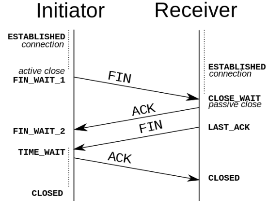

[回到首页](../README.md)

# 网络基础

说明

[TOC]

## 1、TCP/IP四层，OSI七层协议

TCP/IP四层：数据链路层，网络层，传输层，应用层

OSI七层：物理层，数据链路层，网络层，传输层，会话层，表示层，应用层

## 2、TCP与UDP区别

tcp是可靠的传输，需要三次握手建立连接，有流量控制、拥塞控制功能

udp是不可靠的传输，但传输效率比较高，占用资源少（首部仅8字节，tcp至少20字节）。udp支持一对多，而tcp只支持一对一

udp是面向报文的，对应用层交下来的报文即不拆分也不合并。tcp是以字节流的方式进行传输

## 3、http请求的完整过程

## 4、tls握手过程

以rsa握手过程为例

1、第一次握手：客户端client hello，带上客户端随机数（client random）、tls版本号、密码套件列表

2、第二次握手：服务端server hello，带上tls版本号、服务端随机数（server random）、选择的密码套件

3、第三次握手：客户端生成随机数，并用服务器rsa公钥加密（pre_master）并发给服务端，此时客户端根据三个随机数生成会话密钥。客户端发送Change Cipher Spec和Encrypted Handshake Message消息

4、第四次握手：客户端根据三个随机数生成会话密钥。服务端解密验证Encrypted Handshake Message，并发送Change Cipher Spec和Encrypted Handshake Message消息

5、客户端解密验证后，开始发送数据

注意：

1、**tls1.3只需要两次握手，1个RTT时延**

2、https是先三次tcp握手，再四次tls握手的

## 5、tcp三次握手与四次挥手

### 5.1、三次握手

1、**第一次握手**：客户端向服务端发送连接请求报文段。该报文段中包含自身的数据通讯初始序号。请求发送后，客户端便进入 SYN-SENT 状态。

2、**第二次握手**：服务端收到连接请求报文段后，如果同意连接，则会发送一个应答，该应答中也会包含自身的数据通讯初始序号，发送完成后便进入 SYN-RECEIVED 状态。

3、**第三次握手**：当客户端收到连接同意的应答后，还要向服务端发送一个确认报文。客户端发完这个报文段后便进入 ESTABLISHED 状态，服务端收到这个应答后也进入 ESTABLISHED 状态，此时连接建立成功。

**为什么要三次握手而不是两次**：确保双方的发送和接收能力正常。如果只有两次握手，那么客户端发送SYN就建立了连接，而这个SYN可能会遇到超时重传的情况，这样服务端又建立了不必要的连接

### 5.2、四次挥手

TCP 是全双工的，在断开连接时两端都需要发送 FIN 和 ACK。

1、**第一次握手**：若客户端 A 认为数据发送完成，则它需要向服务端 B 发送连接释放请求。

2、**第二次握手**：B 收到连接释放请求后，会告诉应用层要释放 TCP 链接。然后会发送 ACK 包，并进入 CLOSE_WAIT 状态，此时表明 A 到 B 的连接已经释放，不再接收 A 发的数据了。但是因为 TCP 连接是双向的，所以 B 仍旧可以发送数据给 A。

3、**第三次握手**：B 如果此时还有没发完的数据会继续发送，完毕后会向 A 发送连接释放请求，然后 B 便进入 LAST-ACK 状态。

4、**第四次握手**：A 收到释放请求后，向 B 发送确认应答，此时 A 进入 TIME-WAIT 状态。该状态会持续 2MSL（最大段生存期，指报文段在网络中生存的时间，超时会被抛弃） 时间，若该时间段内没有 B 的重发请求的话，就进入 CLOSED 状态。当 B 收到确认应答后，也便进入 CLOSED 状态。

**为什么要四次挥手而不是三次**：因为服务端在收到客户端FIN请求时，可能还有数据要传给客户端，不能立即回复FIN&ACK请求

> 参考：[面试官，不要再问我三次握手和四次挥手 - SegmentFault 思否](https://segmentfault.com/a/1190000020610336)
