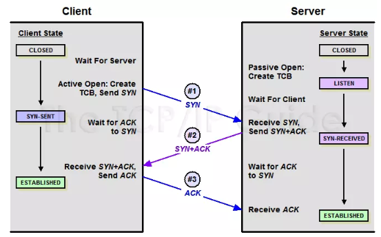

[回到首页](../README.md)

# 1. 网络基础

说明

[TOC]

## 1.1. TCP/IP四层，OSI七层协议

1、TCP/IP四层协议

- Network Access Layer网络访问层（以太网、Wi-Fi等）
- Internet Layer网络层（ip、icmp、arp）
- Transport Layer传输层（tcp、udp）
- Application Layer应用层（http、ftp、dns、dhcp、telnet）

2、OSI七层协议

物理层，数据链路层，网络层，传输层，会话层，表示层，应用层

3、五层协议：结合理论与实际应用，方便解释

物理层，数据链路层，网络层/**网际层**/IP层，运输层，应用层

4、二层交换机与三层交换机

- 普通二层交换机：工作在物理层和数据链路层，基于MAC地址访问，只做数据的转发，并且不能配置IP地址；主要用在接入层/汇聚层

- 三层交换机：工作在物理层、数据链路层和网络层，具有部分路由功能，将二层交换技术和三层转发功能结合在一起，可配置不同vlan的IP地址。主要用于网络核心层，可通过隔离二层网络，保证整体网络稳定性和安全性
- 集线器：工作在物理层，用于转发比特

> 参考：https://www.sundray.com.cn/feedback/1629.html

## 1.2. TCP与UDP区别

tcp是可靠的传输，需要三次握手建立连接，有流量控制、拥塞控制功能

udp是不可靠的传输，但传输效率比较高，占用资源少（首部仅8字节，tcp至少20字节）。udp支持一对多，而tcp只支持一对一

udp是面向报文的，对应用层交下来的报文即不拆分也不合并。tcp是以字节流的方式进行传输

## 1.3. http请求的完整过程

## 1.4. http协议各版本间的区别

### http/0.9

最早的版本，只支持get请求，且响应中无头部信息

### http/1.0

引入了更多的方法，支持响应头信息

### http/1.1

改进：

- 支持长连接，改善性能开销
- 支持管道（pipline）网络传输

缺陷：

- 高延迟使页面速度降低
- 无状态特性使HTTP头部信息量变大，且头部不支持压缩（仅body支持）
- 队头阻塞问题。尽管客户端支持并发请求，但服务端是按请求顺序响应的，如存在顺序依赖且服务器响应慢，则所有请求都不能得到有效处理
- 明文传输的不安全性
- 不支持服务器推送消息

### http/2

改进：

- 头部压缩。使用HPACK算法，不发送相同字段，只发送索引号
- 二进制格式。统称为帧，包括头信息帧和数据帧
- 数据流。每个请求或回应的所有数据包，称为一个数据流
- 多路复用。在一个连接中并发多个请求或响应，而不用按照顺序一一对应，解决了队头阻塞问题
- 服务器推送。

缺陷

- tcp队头阻塞问题。一旦发生丢包，就会阻塞所有的HTTP请求（等待包重传）。

### http/3

改进：使用基于UDP的QUIC协议，实现可靠传输

缺陷：网络环境对UDP不友好

## 1.5. http请求和响应格式，状态码

状态码：

| 分类 |	分类描述 |	举例 |
|-|-|-|
| 1** |	信息，服务器收到请求，需要请求者继续执行操作 |	 |
| 2** |	成功，操作被成功接收并处理 |	200成功 |
| 3** |	重定向，需要进一步的操作以完成请求 |	301永久重定向，302临时重定向，304资源未修改 |
| 4** |	客户端错误，请求包含语法错误或无法完成请求 |	400请求不合法，401未认证，403没有权限，404资源不存在 |
| 5** |	服务器错误，服务器在处理请求的过程中发生了错误 |	500服务器内部错误，502代理上级响应错误，504代理上级响应超时 |

> 参考：
> [HTTP 状态码](https://www.runoob.com/http/http-status-codes.html)
## 1.6. tls握手过程

以rsa握手过程为例

1、第一次握手：客户端client hello，带上客户端随机数（client random）、tls版本号、密码套件列表

2、第二次握手：服务端server hello，带上tls版本号、服务端随机数（server random）、选择的密码套件

3、第三次握手：客户端生成随机数，并用服务器rsa公钥加密（pre_master）并发给服务端，此时客户端根据三个随机数生成会话密钥。客户端发送Change Cipher Spec和Encrypted Handshake Message消息

4、第四次握手：服务端根据三个随机数生成会话密钥。服务端解密验证Encrypted Handshake Message，并发送Change Cipher Spec和Encrypted Handshake Message消息

5、客户端解密验证后，开始发送数据

注意：

1、**tls1.3只需要两次握手，1个RTT时延**

2、https是先三次tcp握手，再四次tls握手的

> 相关文章：[信鸽讲解HTTPS](https://www.freecodecamp.org/news/https-explained-with-carrier-pigeons-7029d2193351)和[译文](https://sunwenfei.gitbook.io/sunwenfei/http/https-pigeon)

## 1.7. tcp三次握手与四次挥手

### 1.7.1. 三次握手

1、**第一次握手**：客户端向服务端发送连接请求报文段。该报文段中包含自身的数据通讯初始序号。请求发送后，客户端便进入 SYN-SENT 状态。

2、**第二次握手**：服务端收到连接请求报文段后，如果同意连接，则会发送一个应答，该应答中也会包含自身的数据通讯初始序号，发送完成后便进入 SYN-RECEIVED 状态。

3、**第三次握手**：当客户端收到连接同意的应答后，还要向服务端发送一个确认报文。客户端发完这个报文段后便进入 ESTABLISHED 状态，服务端收到这个应答后也进入 ESTABLISHED 状态，此时连接建立成功。

**为什么要三次握手而不是两次**：确保双方的发送和接收能力正常。如果只有两次握手，那么客户端发送SYN就建立了连接，而这个SYN可能会遇到超时重传的情况，这样服务端又建立了不必要的连接

**SYN 洪水攻击**：攻击者伪造IP一直发sync请求，导致服务器存在大量半开连接，端口资源用尽。

> 参考：[SYN 洪水 DDoS 攻击 | Cloudflare](https://www.cloudflare.com/zh-cn/learning/ddos/syn-flood-ddos-attack/)

### 1.7.2. 四次挥手

TCP 是全双工的，在断开连接时两端都需要发送 FIN 和 ACK。

1、**第一次握手**：若客户端 A 认为数据发送完成，则它需要向服务端 B 发送连接释放请求。

2、**第二次握手**：B 收到连接释放请求后，会告诉应用层要释放 TCP 链接。然后会发送 ACK 包，并进入 CLOSE_WAIT 状态，此时表明 A 到 B 的连接已经释放，不再接收 A 发的数据了。但是因为 TCP 连接是双向的，所以 B 仍旧可以发送数据给 A。

3、**第三次握手**：B 如果此时还有没发完的数据会继续发送，完毕后会向 A 发送连接释放请求，然后 B 便进入 LAST-ACK 状态。

4、**第四次握手**：A 收到释放请求后，向 B 发送确认应答，此时 A 进入 TIME-WAIT 状态。该状态会持续 2MSL（最大段生存期，指报文段在网络中生存的时间，超时会被抛弃） 时间，若该时间段内没有 B 的重发请求的话，就进入 CLOSED 状态。当 B 收到确认应答后，也便进入 CLOSED 状态。

**为什么要四次挥手而不是三次**：因为服务端在收到客户端FIN请求时，可能还有数据要传给客户端，不能立即回复FIN&ACK请求

> 参考：[面试官，不要再问我三次握手和四次挥手](https://segmentfault.com/a/1190000020610336)

## 1.8. TCP的流量控制与拥塞控制

### 1.8.1. 流量控制

所谓流量控制，就是让发送方的速率不要太快，要让接收方来得及接收。

利用滑动窗口机制：接收方ACK包含rwnd接收窗口的数值，发送方的发送窗口不能超过接收方给出的接收窗口值。

### 1.8.2. 拥塞控制

所谓拥塞控制，就是防止过多的数据注入到网络中，这样可使用网络中的路由器或链路不致过载。

拥塞控制算法：慢开始、拥塞避免、快重传、快恢复。

## 1.9. websocket协议

> 参考：[通讯协议 WebSocket 协议详解 (gohalo.me)](https://gohalo.me/post/websocket-protocol-introduce.html)

## 1.10. 大端小端问题

## 1.11. mqtt消息可靠性

三种QoS质量等级：
QoS 1: 最多交付一次
QoS 2: 至少交付一次
QoS 3: 只交付一次

至少交付一次时，接收方在收到PUBLISH消息后发送PUBACK确认消息给发送方，发送方在接收PUBACK超时时会重传消息，这就可能导致接收方收到两次消息。

只交付一次时，时序图如下。

![[../imgs/Pasted image 20230817163255.png]]
如何避免多次交付消息：发送方在收到PUBREC消息前可以重传，接收方在收到PUBREL消息前接受重传，发送方在收到PUBCOMP消息后可重新使用Packet ID发送新消息。

> 参考：[MQTT QoS 0, 1, 2 介绍 | EMQ (emqx.com)](https://www.emqx.com/zh/blog/introduction-to-mqtt-qos)
