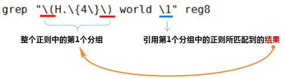

[回到首页](../README.md)

# Shell高级命令

find、awk、sed、grep等

[TOC]

## find查找文件

`find path -option [ -print ] [ -exec -ok command ] {} \;`

### 1、常用过滤条件

- -mount, -xdev : 只检查和指定目录在同一个文件系统下的文件，避免列出其它文件系统中的文件
- -amin n : 在过去 n 分钟内被读取过
- -anewer file : 比文件 file 更晚被读取过的文件
- -atime n : 在过去n天内被读取过的文件
- -cmin n : 在过去 n 分钟内被修改过
- -cnewer file :比文件 file 更新的文件
- -ctime n : 在过去n天内被修改过的文件
- -empty : 空的文件-gid n or -group name : gid 是 n 或是 group 名称是 name
- -ipath p, -path p : 路径名称符合 p 的文件，ipath 会忽略大小写
- -name name, -iname name : 文件名称符合 name 的文件。iname 会忽略大小写
- -size n : 文件大小 是 n 单位，b 代表 512 位元组的区块，c 表示字元数，k 表示 kilo bytes，w 是二个位元组。
- -type c : 文件类型是 c 的文件。
  - d: 目录
  - c: 字型装置文件
  - b: 区块装置文件
  - p: 具名贮列
  - f: 一般文件
  - l: 符号连结
  - s: socket

- -pid n : process id 是 n 的文件

### 2、过滤条件组合：或、且、非

- 或：-o
- 且：-a
- 非：! 或者 `-not`

例如，查找txt和pdf后缀文件，且排除aaa前缀

```bash
>:tmp$ ls -a
.  ..  aaa.txt  bbb.txt  .ccc.txt  ddd.pdf
>:tmp$ find ./ \( -name '*.txt' -o -name '*.pdf' \) -a ! -name 'aaa*'
./.ccc.txt
./bbb.txt
./ddd.pdf
```

### 3、使用正则表示式搜索

`-regex`支持正则表达式匹配文件路径

例如，查找txt和pdf后缀文件，使用正则表达式写法

```bash
>:tmp$ find . -iregex ".*\(\.txt\|\.pdf\)$"
./.ccc.txt
./aaa.txt
./bbb.txt
./ddd.pdf
```

### 4、对查找结果文件执行操作

查找 /var/log 目录中更改时间在 7 日以前的普通文件，并在删除之前询问它们：

```bash
find /var/log -type f -mtime +7 -ok rm {} \;
```

查找当前目录中文件属主具有读、写权限，并且文件所属组的用户和其他用户具有读权限的文件：

```bash
find . -type f -perm 644 -exec ls -l {} \;
```

查找系统中所有文件长度为 0 的普通文件，并列出它们的完整路径：

```bash
find / -type f -size 0 -exec ls -l {} \;
```

### 5、文件名中包含空格时的处理

当文件名中包含空格符时，xargs对文件操作会提示找不到文件

xargs 默认是以空白字符 (空格， TAB，换行符) 来分割记录的，因此文件名` ./file 1.log` 被解释成了两个记录` ./file` 和 `1.log`

```bash
>:~$ find tmp/ -name '*.log'
tmp/file 1.log
tmp/file 2.log
>:~$ find tmp/ -name '*.log' | xargs rm
rm: cannot remove 'tmp/file': No such file or directory
rm: cannot remove '1.log': No such file or directory
rm: cannot remove 'tmp/file': No such file or directory
rm: cannot remove '2.log': No such file or directory
```

为了解决此类问题， 让 find命令在打印出一个文件名之后接着输出一个 NULL 字符 (`'\0'`) 而不是换行符，然后再告诉 xargs 也用 NULL 字符来作为记录的分隔符。这就是 find 的 `-print0` 和 xargs 的` -0` 的来历吧。

```bash
>:~$ find tmp/ -name '*.log' -print0 | xargs -0 rm
>:~$ find tmp/ -name '*.log'
>:~$
```

### 6、排除目录

```bash
# 排除Nfc目录
find . -path ./Nfc -prune -o -type f -name *.mk -print
# 排除多个目录
find . \( -path ./Gallery2 -o -path ./HTMLViewer -o -path ./Nfc \) -prune -o  -name *.mk -print
```

### 0、其他实例：

```bash
# 删除10天前以html后缀的文件，包括带空格的文件
find /usr/local/backups -name "*.html" -mtime +10 -print0 | xargs -0 rm -rfv
find /usr/local/backups -mtime +10 -name "*.html" -exec rm -rf {} \;

# 只在查找当前目录中查找，不查找子目录：-maxdepth \ -mindepth
find . -maxdepth 1 -name '*.txt'
```

> 参考：
>
> [Linux查找目录下的按时间过滤的文件](https://www.cnblogs.com/hhwww/p/10827558.html)

## awk格式化输出

```
awk [选项参数] 'script' var=value file(s)
或
awk [选项参数] -f scriptfile var=value file(s)
```

### 1、多分隔符

```bash
# 使用多个分隔符.先使用空格分割，然后对分割结果再使用","分割
awk -F '[ ,]' '{print $1,$2,$5}' log.txt
```

### 2、过滤

```bash
# 过滤第一列大于2并且第二列等于'Are'的行
awk '$1>2 && $2=="Are" {print $1,$2,$3}' log.txt
```

### 3、正则匹配

```bash
# 输出第二列包含 "th"，并打印第二列与第四列
awk '$2 ~ /th/ {print $2,$4}' log.txt
# 输出包含 "re" 的行
awk '/re/ ' log.txt
# 忽略大小写
awk 'BEGIN{IGNORECASE=1} /this/' log.txt
```

### 4、常用内置变量

-  FS(Field Separator)：输入字段分隔符， 默认为空白字符
-  OFS(Out of Field Separator)：输出字段分隔符， 默认为空白字符
-  RS(Record Separator)：输入记录分隔符(输入换行符)， 指定输入时的换行符
-  ORS(Output Record Separate)：输出记录分隔符（输出换行符），输出时用指定符号代替换行符
-  NF(Number for Field)：当前行的字段的个数(即当前行被分割成了几列)
-  NR(Number of Record)：行号，当前处理的文本行的行号。
-  FNR：各文件分别计数的行号
-  ARGC：命令行参数的个数
-  ARGV：数组，保存的是命令行所给定的各参数

### 5、awk脚本

```bash
$ cat score.txt
Marry   2143 78 84 77
Jack    2321 66 78 45
Tom     2122 48 77 71
Mike    2537 87 97 95
Bob     2415 40 57 62
$ cat cal.awk
#!/bin/awk -f
#运行前
BEGIN {
    math = 0
    english = 0
    computer = 0
 
    printf "NAME    NO.   MATH  ENGLISH  COMPUTER   TOTAL\n"
    printf "---------------------------------------------\n"
}
#运行中
{
    math+=$3
    english+=$4
    computer+=$5
    printf "%-6s %-6s %4d %8d %8d %8d\n", $1, $2, $3,$4,$5, $3+$4+$5
}
#运行后
END {
    printf "---------------------------------------------\n"
    printf "  TOTAL:%10d %8d %8d \n", math, english, computer
    printf "AVERAGE:%10.2f %8.2f %8.2f\n", math/NR, english/NR, computer/NR
}
$ awk -f cal.awk score.txt
NAME    NO.   MATH  ENGLISH  COMPUTER   TOTAL
---------------------------------------------
Marry  2143     78       84       77      239
Jack   2321     66       78       45      189
Tom    2122     48       77       71      196
Mike   2537     87       97       95      279
Bob    2415     40       57       62      159
---------------------------------------------
  TOTAL:       319      393      350
AVERAGE:     63.80    78.60    70.00
```

### 0、其他实例

#### 1 最后一列

```bash
awk '{print $NF}'
```

#### 2 打印除了第一列的所有列

```bash
awk '{for(i=2;i<=NF;i++) {
if(i<NF) {printf "%s ",$i}
else {print $i}
}
}'
# 或
awk '{$1="";print}'
```

#### 3 计算文件大小

```bash
ls -l *.txt | awk '{sum+=$5} END {print sum}'
```

#### 4 打印九九乘法表

```bash
seq 9 | sed 'H;g' | awk -v RS='' '{for(i=1;i<=NF;i++)printf("%dx%d=%d%s", i, NR, i*NR, i==NR?"\n":"\t")}'
```

#### 5 删除首行、尾行

```bash
# 删除首行
awk 'NR>2{print line}{line=$0} END{print line}' a.txt
# 删除尾行
awk 'NR>1{print line}{line=$0}' a.txt
# 删除首尾两行
awk 'NR>2{print line}{line=$0}' a.txt
```


> 参考：
>
> [Linux awk 命令](https://www.runoob.com/linux/linux-comm-awk.html)
>
> [Linux：shell脚本基础（grep及正则表达式、后向引用、sed/awk基础篇）](https://msd.misuland.com/pd/3255818066314925244)

## sed编辑文本

```bash
sed [-nefr] [动作]
```

### 1、选项与参数

- -n ：使用安静(silent)模式。在一般 sed 的用法中，所有来自 STDIN 的数据一般都会被列出到终端上。但如果加上 -n 参数后，则只有经过sed 特殊处理的那一行(或者动作)才会被列出来。
- -e ：直接在命令列模式上进行 sed 的动作编辑；
- -f ：直接将 sed 的动作写在一个文件内， -f filename 则可以运行 filename 内的 sed 动作；
- -r ：sed 的动作支持的是延伸型正规表示法的语法。(默认是基础正规表示法语法)
- -i ：直接修改读取的文件内容，而不是输出到终端。

### 2、动作

动作说明： [n1[,n2]]function
n1, n2 ：不见得会存在，一般代表『选择进行动作的行数』，举例来说，如果我的动作是需要在 10 到 20 行之间进行的，则『 10,20[动作行为] 』

- 
  a ：新增， a 的后面可以接字串，而这些字串会在新的一行出现(目前的下一行)～
- c ：取代， c 的后面可以接字串，这些字串可以取代 n1,n2 之间的行！
- d ：删除，因为是删除啊，所以 d 后面通常不接任何咚咚；
- i ：插入， i 的后面可以接字串，而这些字串会在新的一行出现(目前的上一行)；
- p ：列印，亦即将某个选择的数据印出。通常 p 会与参数 sed -n 一起运行～
- s ：取代，可以直接进行取代的工作哩！通常这个 s 的动作可以搭配正规表示法！例如 1,20s/old/new/g 就是啦！

### 3、实例

#### 3.1 数据搜寻并执行命令

搜索/etc/passwd,找到root对应的行，执行后面花括号中的一组命令，每个命令之间用分号分隔，这里把bash替换为blueshell，再输出这行：

```
nl /etc/passwd | sed -n '/root/{s/bash/blueshell/;p;q}'    
1  root:x:0:0:root:/root:/bin/blueshell
```

#### 3.2 数据的搜寻并替换

```bash
sed 's/要被取代的字串/新的字串/g'
```

#### 3.3 多点编辑

一条sed命令，删除/etc/passwd第三行到末尾的数据，并把bash替换为blueshell

```
nl /etc/passwd | sed -e '3,$d' -e 's/bash/blueshell/'
1  root:x:0:0:root:/root:/bin/blueshell
2  daemon:x:1:1:daemon:/usr/sbin:/bin/sh
```

#### 3.4 查找并插入

启动脚本添加一条命令

```bash
sed -i '/exit 0/i touch /tmp/uptime' /etc/rc.local
```

#### 3.5 删除首行、尾行

```bash
sed '1d' a.txt
sed '$d' a.txt
```


> 参考：
>
> [Linux sed 命令]([Linux sed 命令 | 菜鸟教程 (runoob.com)](https://www.runoob.com/linux/linux-comm-sed.html))

## grep查找文本

```bash
grep [OPTION]... PATTERNS [FILE]...
```

grep全称是Global Regular Expression Print，表示全局正则表达式版本

**egrep = grep -E：扩展的正则表达式** （除了**\< , \> , \b** 使用其他正则都可以去掉\）

### 1、常用参数

-  -A<显示行数>：除了显示符合范本样式的那一列之外，并显示该行之后的内容。
-  -B<显示行数>：除了显示符合样式的那一行之外，并显示该行之前的内容。
-  -C<显示行数>：除了显示符合样式的那一行之外，并显示该行之前后的内容。
-  -c：统计匹配的行数
-  **-e ：实现多个选项间的逻辑or 关系**
-  **-E：扩展的正则表达式**
-  -f FILE：从FILE获取PATTERN匹配
-  -F ：相当于fgrep
-  -i --ignore-case #忽略字符大小写的差别。
-  -n：显示匹配的行号
-  -o：仅显示匹配到的字符串
-  -q： 静默模式，不输出任何信息
-  -s：不显示错误信息。
-  **-v：显示不被pattern 匹配到的行，相当于[^] 反向匹配**
-  -w ：匹配 **整个单词**

### 2、实例

2.1 查找关键字，显示关键字所在行号

```bash
 $ grep -n "bash" /etc/passwd
1:root:x:0:0:root:/root:/bin/bash
```

2.2 查找关键字，显示匹配到的行数

```bash
 $ grep -c "nologin" /etc/passwd
27
```

2.3 查找关键字，列出包含关键字的文件名

```bash
grep -rl "bash" ./
```

2.4 查找多个关键字

```bash
 $ grep -e "root" -e "hubery" /etc/passwd
root:x:0:0:root:/root:/bin/bash
hubery:x:1000:1000:,,,:/home/hubery:/usr/bin/zsh
```

或

```bash
 $ grep "bash\|zsh" /etc/passwd
root:x:0:0:root:/root:/bin/bash
hubery:x:1000:1000:,,,:/home/hubery:/usr/bin/zsh
```

2.5 排除包含关键字的行

```bash
 $ grep -v "nologin" /etc/passwd
root:x:0:0:root:/root:/bin/bash
sync:x:4:65534:sync:/bin:/bin/sync
tss:x:106:111:TPM software stack,,,:/var/lib/tpm:/bin/false
pollinate:x:111:1::/var/cache/pollinate:/bin/false
hubery:x:1000:1000:,,,:/home/hubery:/usr/bin/zsh
```

2.6 只打印匹配到的内容

```bash
# echo '222.222.114.222 - - [29/Jul/2021:09:41:59 +0800] "POST /index.php/Ap/get_ip HTTP/1.1" 200 0.000 {\x22sn\x22:\x22B8Z9330005\x22,\x22mac\x22:\x22a80cca9716e2\x22,\x22pwd\x22:\x22\x22}\x0D 104 "-" "Mozilla/4.0" "-"'| grep -oP '(?<=sn\\x22:\\x22)[A-Z0-9]+(?=\\x22)'
B8Z9330005
```

2.7 去掉空行

```bash
tar -tzf upgrade_pkgs.tar.gz | sed 's#\./##g' | grep -v '^$'
```


### 3、正则匹配

```bash
 $ grep "\(bash\|zsh\)" /etc/passwd
root:x:0:0:root:/root:/bin/bash
hubery:x:1000:1000:,,,:/home/hubery:/usr/bin/zsh
 $ grep -E "(bash|zsh)" /etc/passwd
root:x:0:0:root:/root:/bin/bash
hubery:x:1000:1000:,,,:/home/hubery:/usr/bin/zsh
 $ echo "libgcc-4.8.5-4.h5.x86_64.rpm" | grep -Eo "[0-9]+\.[0-9]+.*x86_64"
4.8.5-4.h5.x86_64
```

#### 3.1 匹配字符

-  . 匹配任意单个字符，不能匹配空行
-  [] 匹配指定范围内的任意单个字符
-  [^] 取反
-  [:alnum:] 或 [0-9a-zA-Z]
-  [:alpha:] 或 [a-zA-Z]
-  [:upper:] 或 [A-Z]
-  [:lower:] 或 [a-z]
-  [:blank:] 空白字符（空格和制表符）
-  [:space:] 水平和垂直的空白字符（比[:blank:]包含的范围广）
-  [:cntrl:] 不可打印的控制字符（退格、删除、警铃...）
-  [:digit:] 十进制数字 或[0-9]
-  [:xdigit:]十六进制数字
-  [:graph:] 可打印的非空白字符
-  [:print:] 可打印字符
-  [:punct:] 标点符号

#### 3.2 配置次数

-  *****  匹配前面的字符任意次，**包括0次**，贪婪模式：尽可能长的匹配
-  **.\*** 任意长度的任意字符，**不包括0次**
-  **\?**  匹配其前面的字符**0 或 1次**
-  **\+** 匹配其前面的字符**至少1次**
-  \{n\}  匹配前面的字符n次
-  \{m,n\}  匹配前面的字符至少m 次，至多n次
-  \{,n\}  匹配前面的字符至多n次
-  \{n,\}  匹配前面的字符至少n次

#### 3.3 位置锚定：定位出现的位置

-  ^  行首锚定，用于模式的最左侧
-  $  行尾锚定，用于模式的最右侧
-  ^PATTERN$，用于模式匹配整行
-  ^$ 空行
-  ^[[:space:]].*$  空白行
-  \< 或 \b  词首锚定，用于单词模式的左侧
-  \> 或 \b  词尾锚定；用于单词模式的右侧
-  \<PATTERN\>

#### 3.4 分组和后向引用

① 分组：\(\) 将一个或多个字符捆绑在一起，当作一个整体进行处理

　　分组括号中的模式匹配到的内容会被正则表达式引擎记录于内部的变量中，这些变量的命名方式为: \1, \2, \3, ...

② 后向引用

引用前面的分组括号中的模式所匹配字符，而非模式本身

\1 表示从左侧起第一个左括号以及与之匹配右括号之间的模式所匹配到的字符

\2 表示从左侧起第2个左括号以及与之匹配右括号之间的模式所匹配到的字符，以此类推

\& 表示前面的分组中所有字符

③ 流程分析如下：



```bash
 $ grep "\(He\).*\1" << EOF
Hello world Hello world
Hiiii world Hiiii world
Hello world Heiii wwwww
EOF
Hello world Hello world
Hello world Heiii wwwww
```

### 4、Perl正则表达式

```bash
grep -P
```


> 参考：
>
> [Linux文本三剑客超详细教程---grep、sed、awk](https://www.cnblogs.com/along21/p/10366886.html)
>
> [Perl Compatible Regular Expressions](https://learnbyexample.github.io/learn_gnugrep_ripgrep/perl-compatible-regular-expressions.html#perl-compatible-regular-expressions)


## getopts获取命令行参数

## trap信号处理

## xargs

```bash
# 哪些目录包含图片文件
find /wns/ -path /wns/docker_root -prune -o -type f -name *.jpg -print0 | xargs -0 dirname | uniq
find /wns/ -path /wns/docker_root -prune -o -type f -regextype posix-extended -regex ".*\.(jpg|png|gif)" -print0 | xargs -0 dirname | uniq
```


[xargs 命令教程 - 阮一峰的网络日志 (ruanyifeng.com)](https://www.ruanyifeng.com/blog/2019/08/xargs-tutorial.html)
