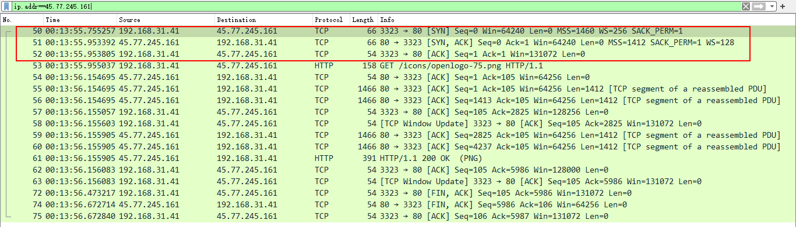

[回到首页](../README.md)

# 1. 工具

[TOC]

## 1.1. openssl

1、获取证书信息

```bash
openssl x509 -noout -text -in cert.pem
```

2、查看网站证书信息

```bash
echo | openssl s_client -connect gj.sundray.com.cn:443
```

3、查看网站证书过期世间

```bash
echo | openssl s_client -servername gj.sundray.com.cn -connect gj.sundray.com.cn:443 2>/dev/null | openssl x509 -noout -dates
```


> 参考：
>
> [openssl 查看证书细节](https://www.cnblogs.com/shenlinken/p/9968274.html)
>
> [openssl 查看证书]()

## 1.2. wireshark与tcpdump

1、抓https的tls握手包

```bash
tcpdump -ni eth0 "tcp port 443 and (tcp[((tcp[12] & 0xf0) >> 2)] = 0x16)"
```

>  参考：[仅使用tcpdump捕获ssl握手](https://www.thinbug.com/q/39624745)

2、wireshark常用过滤条件

- ip过滤：`ip.addr`过滤源或目的ip，`ip.src`过滤源ip，`ip.dst`过滤目的ip，如`ip.addr==45.77.245.161`
- 端口过滤：`tcp.port`过滤源或目的端口，`tcp.srcport`过滤源端口，`tcp.dstport`过滤目的端口，如`tcp.srcport==443`
- 协议过滤：直接输入协议名即可，例如`icmp`、`ssl`
- http模式过滤：`http.request.method=="GET"`过滤GET请求
- 连接符：`and`、`or`、`&&`、`||`

3、使用抓包工具理解http三次握手

发送端发送一个SYN=1，ACK=0标志的数据包给接收端，请求进行连接；

接收端收到请求并允许连接的话，会发送一个SYN=1，ACK=1标志的数据包给发送端，告诉它可以通讯了；

发送端发送一个SYN=0，ACK=1标志的数据包给接收端，告诉它连接已确认。之后tcp连接建立，开始通讯。



4、TCP标志位

在TCP层，有个FLAGS字段，这个字段有以下几个标识：SYN, FIN, ACK, PSH, RST, URG。其中，对于我们日常的分析有用的就是前面的五个字段。它们的含义是：SYN表示建立连接，FIN表示关闭连接，ACK表示响应，PSH表示有 DATA数据传输，RST表示连接重置。

其中，ACK是可能与SYN，FIN等同时使用的，比如SYN和ACK可能同时为1，它表示的就是建立连接之后的响应，如果只是单个的一个SYN，它表示的只是建立连接。

TCP的几次握手就是通过这样的ACK表现出来的。但SYN与FIN是不会同时为1的，因为前者表示的是建立连接，而后者表示的是断开连接。

> 参考：
>
> [Wireshark常用过滤使用方法](https://www.cnblogs.com/nmap/p/6291683.html)

## 1.3. rsync实现增量备份

调用实例：增量备份家目录

```bash
#!/bin/bash

# A script to perform incremental backups using rsync

set -o errexit
set -o nounset
set -o pipefail

readonly SOURCE_DIR="${HOME}"
readonly BACKUP_DIR="/mnt/data/backups"
readonly DATETIME="$(date '+%Y-%m-%d_%H:%M:%S')"
readonly BACKUP_PATH="${BACKUP_DIR}/${DATETIME}"
readonly LATEST_LINK="${BACKUP_DIR}/latest"

mkdir -p "${BACKUP_DIR}"

rsync -av --delete \
  "${SOURCE_DIR}/" \
  --link-dest "${LATEST_LINK}" \
  --exclude=".cache" \
  "${BACKUP_PATH}"

rm -rf "${LATEST_LINK}"
ln -s "${BACKUP_PATH}" "${LATEST_LINK}"
```

上面脚本中，每一次同步都会生成一个新目录`${BACKUP_DIR}/${DATETIME}`，并将软链接`${BACKUP_DIR}/latest`指向这个目录。下一次备份时，就将`${BACKUP_DIR}/latest`作为基准目录，生成新的备份目录。最后，再将软链接`${BACKUP_DIR}/latest`指向新的备份目录。

> 参考：[rsync 用法教程]([rsync 用法教程 - 阮一峰的网络日志 (ruanyifeng.com)](https://www.ruanyifeng.com/blog/2020/08/rsync.html))

## 1.4. inotifywait文件修改自动处理

linux下inotifywait命令可以监控文件变化，以做进一步处理

1、首先安装：

`yum install inotify-tools -y`

2、调用实例：下面脚本可以监控上传的js文件并把文件拷贝到docker容器，让代码生效

```bash
#!/bin/sh

CURPATH=`pwd`
webui_dir=/root/hyc/spm__webui/js
docker_webui_dir=vh_web:/spm/webui/SPM

inotifywait -mr --timefmt '%d/%m/%y %H:%M' --format '%T %w %f' \
-e close_write ${webui_dir} | while read date time dir file; do

	FILECHANGE=${dir}${file}
	# convert absolute path to relative
	FILECHANGEREL=`echo "$FILECHANGE" | sed 's_'$CURPATH'/__'`

	docker cp $FILECHANGE ${docker_webui_dir}${FILECHANGE:${#webui_dir}}
	echo "At ${time} on ${date}, file $FILECHANGE was synced to docker"
done
```

## 1.5. go实现telnet日志服务

TODO
