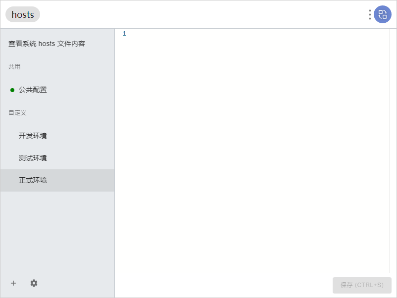
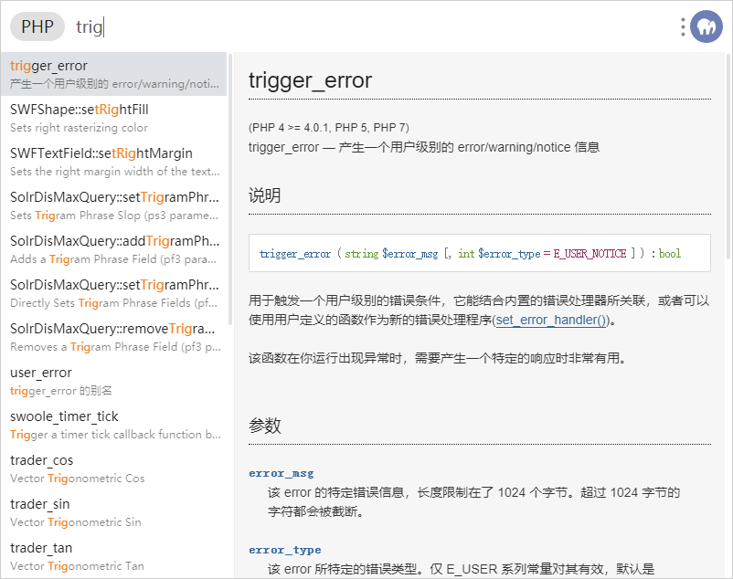
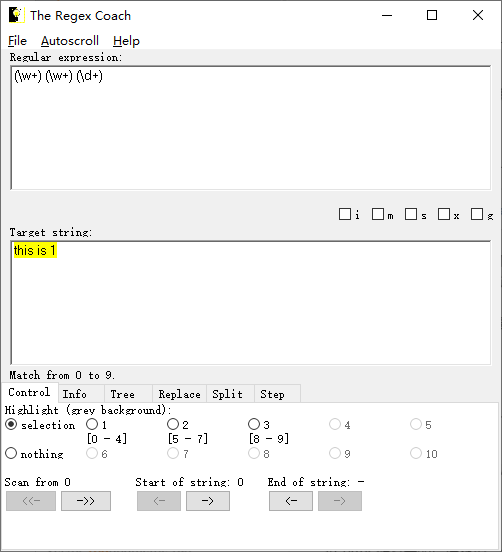

[回到首页](../README.md)

# Windows下辅助工具

[TOC]

## 1、截图贴图工具Snipaste

## 2、识图工具：天若ocr

最后一个开源免费版本，见[附件](./attach/天若OCR开源版V5.0.0.zip)，需自己申请百度的文字识别接口

## 3、开发辅助利器：uTools

仅同步功能需收费，常使用它来设置hosts、查php手册、json格式化、base64编解码、测试正则表达式

## 4、正则表达式：The Regex Coach

测试正则表达式非常方便，见[附件](./attach/regex-coach.exe)，或[从官网下载](http://weitz.de/files/regex-coach.exe)

## 5、文件查找：Everything

文件查找很快，不爱整理文件的话会感觉很好用

## 6、最好用的markdown编辑器：Typora

## 7、密码管理工具：KeePass 2

配合OneDrive很方便，iOS推荐使用奇密，Android推荐使用KeePassDX，都是很高质量的app，配合OneDrive或GoogleDrive可以做到多端同步。KeePass2官网下载地址：[Downloads - KeePass](https://keepass.info/download.html)

## 8、Git客户端：Soucetree、Fork

放上[Sourcetree官网](https://www.sourcetreeapp.com/)和[Fork官网](https://www.git-fork.com/)。Fork似乎需要科学上网才能进，而且是个人免费，商业收费

## 9、HTTP调试抓包工具：Fiddler

配合浏览器扩展SwitchyOmega可快速切换到Fiddler代理，相比Postman更适合高级玩家。

